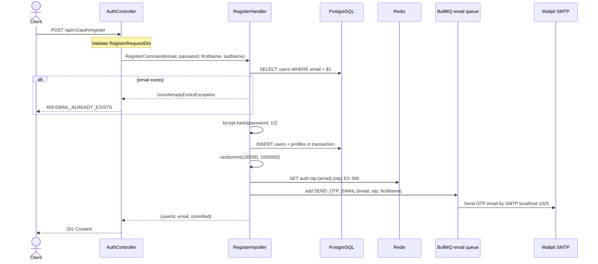

# 01 — Register API Spec

> **API:** `POST /api/v1/auth/register`
> **Auth:** Public
> **Mục tiêu:** Tạo tài khoản mới, lưu OTP vào Redis, gửi OTP qua email bằng BullMQ + Mailpit local. Không cấp token.

---

## Tổng Quan

API register nhận `email`, `password`, `firstName`, `lastName`. Handler kiểm tra email trùng, hash password bằng bcrypt, tạo `users` + `profiles` trong một transaction, sinh OTP 6 số, lưu OTP vào Redis với TTL 5 phút, rồi publish job gửi email vào BullMQ queue `email`.

Response không trả `access_token` hoặc `refresh_token`. User phải verify email bằng OTP trước khi được cấp token ở flow sau.

Hiện tại controller có decorator `@Throttle({ default: { limit: 5, ttl: 60000 } })`, tức tối đa 5 request/phút cho route này khi ThrottlerGuard được bật. Trong code hiện tại `@UseGuards(ThrottlerGuard)` đang comment ở `AuthController`, nên rate limit chưa thực thi ở controller.

---

## 1. Sequence Diagram



---

## 2. Request

Body dùng camelCase theo DTO hiện tại.

```json
{
  "email": "user@example.com",
  "password": "Password123!",
  "firstName": "Nguyen Van",
  "lastName": "A"
}
```

| Field | Type | Required | Rule |
|-------|------|----------|------|
| `email` | string | Yes | `@IsEmail()`, `@IsNotEmpty()` |
| `password` | string | Yes | String mạnh: min 8 ký tự, có chữ hoa, chữ thường, số, ký tự đặc biệt |
| `firstName` | string | Yes | `@IsString()`, `@IsNotEmpty()` |
| `lastName` | string | Yes | `@IsString()`, `@IsNotEmpty()` |

---

## 3. Response

Controller gọi:

```ts
return this.responseService.created(
  result,
  'User registration initiated successfully',
);
```

Sau đó `ResponseInterceptor` gắn thêm `path` và `method`.

### 201 Created

```json
{
  "message": "User registration initiated successfully",
  "data": {
    "userId": "018fd1e8-3c74-7f41-9fb2-78a7790d1b2a",
    "email": "user@example.com",
    "isVerified": false
  },
  "timestamp": "2026-06-02T10:30:00.000Z",
  "path": "/api/v1/auth/register",
  "method": "POST"
}
```

| Field | Type | Mô tả |
|-------|------|-------|
| `message` | string | `"User registration initiated successfully"` |
| `data.userId` | string | ID user vừa tạo |
| `data.email` | string | Email đã đăng ký, được normalize trong domain entity |
| `data.isVerified` | boolean | `false` cho user mới |
| `timestamp` | string | ISO datetime do response DTO tạo |
| `path` | string | Request path |
| `method` | string | HTTP method |

Response không chứa token.

---

## 4. Register Handler Steps

Code hiện tại trong `RegisterHandler.execute()`:

1. Nhận input đã validate từ API layer.
2. Check duplicate email bằng `userRepository.findByEmail(email)`.
3. Hash password bằng `bcryptjs.hash(password, 12)`.
4. Tạo domain entities `User` và `Profile`.
5. Lưu `users` + `profiles` bằng `saveWithProfile()` trong một transaction.
6. Sinh OTP 6 số bằng `crypto.randomInt(100000, 1000000)` và lưu Redis TTL 300 giây.
7. Publish job `SEND_OTP_EMAIL` vào BullMQ queue `email`.
8. Trả response tối giản `{ userId, email, isVerified }`.

---

## 5. Redis

OTP được lưu qua `RedisOtpStore`.

```ts
await redis.set(`auth:otp:${email}`, otp, 'EX', 300);
```

| Key | Value | TTL | Mục đích |
|-----|-------|-----|----------|
| `auth:otp:{email}` | OTP 6 số | 300 giây | Verify email sau register |

Ví dụ kiểm tra OTP local:

```bash
docker exec -it node-mind-redis redis-cli GET auth:otp:user@example.com
docker exec -it node-mind-redis redis-cli TTL auth:otp:user@example.com
```

---

## 6. BullMQ + Mailpit

Queue name:

```ts
export const EMAIL_QUEUE = 'email';
```

Job name:

```ts
export const SEND_OTP_EMAIL_JOB = 'SEND_OTP_EMAIL';
```

Job payload:

```json
{
  "email": "user@example.com",
  "otp": "123456",
  "firstName": "Nguyen Van"
}
```

Producer:

```ts
await emailQueue.add('SEND_OTP_EMAIL', job, {
  attempts: 3,
  backoff: {
    type: 'exponential',
    delay: 1000
  },
  removeOnComplete: true,
  removeOnFail: 100
});
```

Worker `MailProcessor` xử lý job và gọi `MailService.sendOtpEmail()`. Local SMTP dùng Mailpit:

```env
MAIL_HOST=localhost
MAIL_PORT=1025
MAIL_FROM="Node Mind <noreply@node-mind.local>"
MAILPIT_UI_PORT=8025
```

Mở Mailpit UI:

```text
http://localhost:8025
```

---

## 7. Docker Local Services

Các service local liên quan:

| Service | URL / Port | Ghi chú |
|---------|------------|---------|
| Redis | `localhost:6379` | App chạy ngoài Docker dùng host này |
| RedisInsight | `http://localhost:5540` | UI quản lý Redis |
| Mailpit SMTP | `localhost:1025` | Nodemailer gửi vào đây |
| Mailpit UI | `http://localhost:8025` | Xem email OTP |

Start services:

```bash
docker compose up -d redis redisinsight mailpit
```

Khi connect RedisInsight đang chạy trong Docker, dùng:

```text
Host: redis
Port: 6379
Database: 0
```

---

## 8. Error Cases

Error response được format bởi `ApiExceptionFilter` + `ResponseService`.

### 400 VALIDATION_ERROR

Xảy ra khi DTO validation fail.

```json
{
  "message": "Validation failed",
  "error": {
    "code": "VALIDATION_ERROR",
    "details": [
      "email must be an email",
      "password: Password must be at least 8 characters and include uppercase, lowercase, number, and special character"
    ]
  },
  "timestamp": "2026-06-02T10:30:00.000Z",
  "path": "/api/v1/auth/register",
  "method": "POST"
}
```

### 409 EMAIL_ALREADY_EXISTS

Xảy ra khi `userRepository.findByEmail(email)` tìm thấy user.

```json
{
  "message": "User with email user@example.com already exists.",
  "error": {
    "code": "EMAIL_ALREADY_EXISTS",
    "details": null
  },
  "timestamp": "2026-06-02T10:30:00.000Z",
  "path": "/api/v1/auth/register",
  "method": "POST"
}
```

### 429 RATE_LIMIT_EXCEEDED

Chỉ xảy ra khi ThrottlerGuard được bật.

```json
{
  "message": "ThrottlerException: Too Many Requests",
  "error": {
    "code": "RATE_LIMIT_EXCEEDED",
    "details": null
  },
  "timestamp": "2026-06-02T10:30:00.000Z",
  "path": "/api/v1/auth/register",
  "method": "POST"
}
```

---

## 9. Test Scenarios

| ID | Scenario | Expected |
|----|----------|----------|
| T-R01 | Register data hợp lệ | 201 + `data.userId` + `data.isVerified=false` |
| T-R02 | Email đã tồn tại | 409 `EMAIL_ALREADY_EXISTS` |
| T-R03 | Email sai format | 400 `VALIDATION_ERROR` |
| T-R04 | Password yếu | 400 `VALIDATION_ERROR` |
| T-R05 | `firstName` rỗng | 400 `VALIDATION_ERROR` |
| T-R06 | `lastName` rỗng | 400 `VALIDATION_ERROR` |
| T-R07 | Response thành công | Không có `access_token`, không có `refresh_token` |
| T-R08 | OTP Redis | Có key `auth:otp:{email}`, TTL <= 300 |
| T-R09 | BullMQ email job | Job `SEND_OTP_EMAIL` được enqueue vào queue `email` |
| T-R10 | Mailpit | Email OTP xuất hiện trong `http://localhost:8025` |
| T-R11 | Profile transaction fail | Không để lại user mồ côi nếu tạo profile lỗi |
