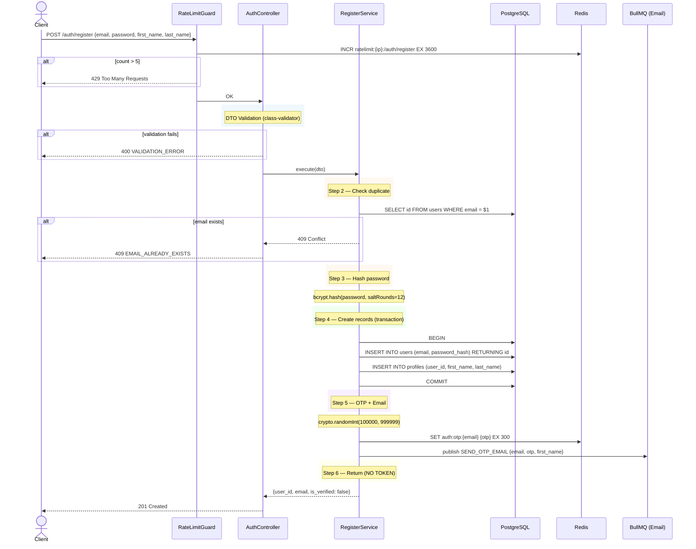
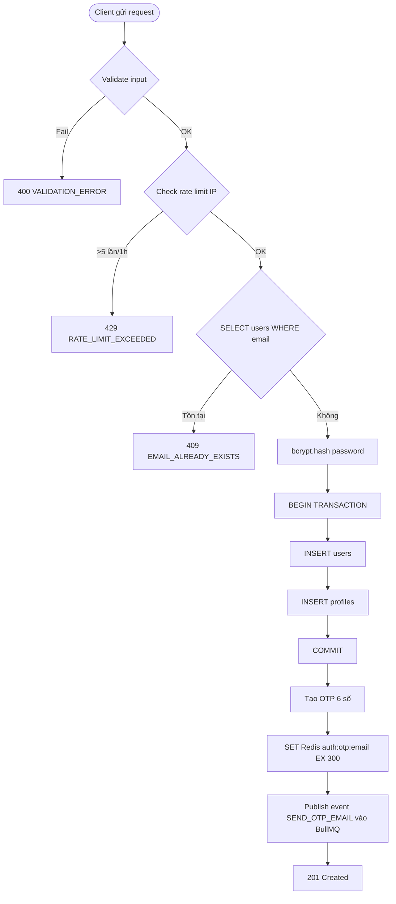

# 01 — Register API Spec

> **API:** `POST /api/v1/auth/auth/register`
> **Auth:** Public
> **Mục tiêu:** Tạo tài khoản mới, gửi OTP qua email. Không cấp token.

---

## Tổng Quan

API này là bước đầu tiên trong luồng đăng ký người dùng. Client gửi email, password, họ và tên. Hệ thống tạo bản ghi `users` + `profiles` trong 1 transaction, sinh mã OTP 6 số lưu vào Redis (TTL 5 phút), rồi đẩy email OTP vào BullMQ để gửi bất đồng bộ.

Điểm quan trọng nhất của API này: **không cấp token**. Người dùng phải xác thực email qua API `verify-email` thì tài khoản mới được kích hoạt và token mới được cấp. Điều này đảm bảo chỉ email thật mới truy cập được hệ thống.

Một lớp rate limit được đặt ở tầng Guard: tối đa 5 lần đăng ký từ 1 IP trong 1 giờ. Mục đích là chống bot tạo tài khoản hàng loạt.

---

## 1. Sequence Diagram

Sơ đồ dưới đây mô tả toàn bộ tương tác giữa các thành phần trong luồng register. Client bắt đầu gửi request, đi qua lớp RateLimitGuard kiểm tra giới hạn IP, qua Controller validate input, rồi vào Service xử lý nghiệp vụ chính: kiểm tra email trùng, hash password, tạo 2 bản ghi trong transaction, sinh OTP, lưu Redis, và cuối cùng publish email vào queue. Điểm kết thúc là 201 Created — không có token.

---

## 2. Activity Diagram

Flowchart này tập trung vào các điểm rẽ nhánh logic: validate input, rate limit, check email tồn tại. Luồng chính (đường thẳng xuống dưới) là happy path: tất cả điều kiện đều OK, tiến thẳng đến 201 Created. Các nhánh rẽ là các error case. Không có vòng lặp, không có retry — flow là tuyến tính 1 chiều.

---

## 3. Request / Response Spec

### Request

Chỉ có 4 field bắt buộc. Password không truyền kèm `confirm_password` — client tự xử lý việc khớp mật khẩu. Họ tên tách riêng `first_name` và `last_name` để linh hoạt hiển thị (có thể chỉ hiện first name trong UI nhẹ).

| Field | Type | Required | Rule |
|-------|------|----------|------|
| `email` | string | Yes | Định dạng email hợp lệ |
| `password` | string | Yes | Min 8 ký tự, ít nhất 1 chữ hoa, 1 chữ thường, 1 số, 1 ký tự đặc biệt |
| `first_name` | string | Yes | Min 1 ký tự |
| `last_name` | string | Yes | Min 1 ký tự |

### Response (201 Created)

Phản hồi tối giản: chỉ trả về `user_id`, `email`, và `is_verified: false`. Không có token vì user chưa xác thực email. `user_id` để client có thể gọi lại API resend-otp hoặc hiển thị trạng thái chờ verify.

| Field | Type | Mô tả |
|-------|------|-------|
| `success` | boolean | `true` |
| `message` | string | Thông báo tiếng Việt |
| `data.user_id` | UUID | ID của user vừa tạo |
| `data.email` | string | Email đã đăng ký |
| `data.is_verified` | boolean | Luôn `false` |

> **Quan trọng:** Response **KHÔNG** chứa `access_token` hoặc `refresh_token`.

---

## 4. Validation Rules

Tất cả rule được chạy ở tầng DTO (class-validator) trước khi request vào Service. Nếu có lỗi, trả ngay 400 kèm `details[]` array liệt kê từng field lỗi. Không tuần tự — tất cả lỗi được trả về cùng lúc để client sửa 1 lần.

Độ phức tạp password được chọn ở mức trung bình (8 ký tự, 4 loại ký tự) để cân bằng giữa bảo mật và UX. Không bắt buộc quá 16 ký tự ở giai đoạn MVP.

| Rule | Field | Mô tả |
|------|-------|-------|
| V-R01 | `email` | Phải đúng format email (có `@`, domain hợp lệ) |
| V-R02 | `password` | Min 8 ký tự |
| V-R03 | `password` | Ít nhất 1 chữ hoa (`[A-Z]`) |
| V-R04 | `password` | Ít nhất 1 chữ thường (`[a-z]`) |
| V-R05 | `password` | Ít nhất 1 số (`[0-9]`) |
| V-R06 | `password` | Ít nhất 1 ký tự đặc biệt (`[^a-zA-Z0-9]`) |
| V-R07 | `first_name` | Không được rỗng, min 1 ký tự |
| V-R08 | `last_name` | Không được rỗng, min 1 ký tự |

---

## 5. Error Cases

API này có đúng 3 trường hợp lỗi, mỗi lỗi tương ứng với 1 tầng kiểm tra khác nhau: validation (tầng DTO), business logic (tầng Service), và rate limiting (tầng Guard).

**400 — VALIDATION_ERROR** xảy ra khi input không vượt qua class-validator. Response trả về `details[]` array, mỗi item có `field` và `message` để client hiển thị lỗi ngay cạnh ô input tương ứng. Không bao giờ để lộ tên bảng, tên cột, hay stack trace.

**409 — EMAIL_ALREADY_EXISTS** là lỗi business logic duy nhất. Chỉ trả thông báo đơn giản, không tiết lộ trạng thái `is_verified` của email đó. Lý do: nếu ta trả "email đã đăng ký nhưng chưa verify" thì attacker có thể dùng API này để kiểm tra email nào đã đăng ký (enumeration attack).

**429 — RATE_LIMIT_EXCEEDED** được bắn ra từ Guard trước khi request vào Controller. Kèm `Retry-After` header để client biết khi nào có thể thử lại. Window 1 giờ được chọn vì đủ dài để chặn bot nhưng không gây khó chịu cho người dùng thật.

| HTTP | Code | Trigger |
|------|------|---------|
| 400 | `VALIDATION_ERROR` | Input không đúng rule ở mục 4 |
| 409 | `EMAIL_ALREADY_EXISTS` | Email đã có trong bảng `users` |
| 429 | `RATE_LIMIT_EXCEEDED` | IP gọi >5 lần trong 1 giờ |

---

## 6. Database Operations

Chỉ có 3 thao tác database, tất cả đều đơn giản và nhanh. Điểm cần lưu ý duy nhất: 2 lệnh INSERT (users và profiles) phải nằm trong 1 transaction. Nếu INSERT profiles thất bại (vd: vi phạm UNIQUE constraint trên `user_id`), toàn bộ transaction rollback — sẽ không có tình trạng "user tồn tại nhưng không có profile".

| Step | Table | Operation | Điều kiện |
|------|-------|-----------|-----------|
| 2 | `users` | SELECT | `WHERE email = $1` |
| 4 | `users` | INSERT | `email, password_hash` |
| 4 | `profiles` | INSERT | `user_id, first_name, last_name` |

---

## 7. Redis Operations

Hai key Redis được sử dụng, phục vụ hai mục đích hoàn toàn khác nhau:

`ratelimit:{ip}:/auth/register` là counter với TTL 3600s. Mỗi lần gọi API, counter tăng 1. Nếu là lần đầu tiên trong window, EXPIRE được set. Khi counter > 5, request bị chặn. Sau 1 giờ key tự xóa, bắt đầu window mới.

`auth:otp:{email}` lưu OTP 6 số với TTL 300s (5 phút). TTL ngắn để giảm thiểu rủi ro OTP bị đánh cắp — nếu email bị delay quá 5 phút, user có thể gọi `resend-otp` để lấy mã mới.

| Key | Operation | TTL | Mục đích |
|-----|-----------|-----|----------|
| `ratelimit:{ip}:/auth/register` | INCR + EXPIRE | 3600s | Chặn brute-force register |
| `auth:otp:{email}` | SET | 300s | Lưu OTP để verify sau |

---

## 8. Side Effects

API này có 2 side effect, đều xảy ra bên ngoài database:

Việc gửi email được đẩy vào BullMQ queue `email` và xử lý bất đồng bộ. Điều này có nghĩa: nếu email service đang lỗi, API register vẫn trả 201 thành công — user sẽ thấy "vui lòng kiểm tra email" nhưng email có thể đến muộn. Trade-off này được chấp nhận vì không muốn thời gian phản hồi API phụ thuộc vào email provider bên ngoài.

OTP được tạo bằng `crypto.randomInt()` — cryptographic random, không phải `Math.random()`. Điều này ngăn attacker đoán được OTP tiếp theo dựa trên OTP trước đó.

| # | Hành động | Cơ chế |
|---|-----------|--------|
| 1 | Gửi email OTP | Async qua BullMQ queue `email` — non-blocking |
| 2 | Tạo OTP 6 số | `crypto.randomInt(100000, 999999)` — cryptographic random |

---

## 9. Dependencies

5 dependency chính, chia làm 2 nhóm:

**Infrastructure (3):** PostgreSQL (persistent storage), Redis (temporary/volatile storage), BullMQ (async job queue). Nếu bất kỳ infrastructure nào chết, API sẽ fail — không có fallback.

**Library (2):** bcrypt để hash password với saltRounds=12 (đủ mạnh cho năm 2026, thời gian hash khoảng 250-300ms), class-validator để validate DTO ở tầng controller.

| Service/Module | Purpose |
|----------------|---------|
| `PostgreSQL` | Lưu `users` + `profiles` |
| `Redis` | Rate limit + OTP storage |
| `BullMQ` | Async email delivery |
| `bcrypt` | Hash password (saltRounds=12) |
| `class-validator` | DTO validation |

---

## 10. Test Scenarios

Các test case được nhóm theo 3 nhóm:

**Happy path (T-R01, T-R09, T-R10, T-R11):** Kiểm tra flow chính hoạt động end-to-end — từ request hợp lệ đến khi OTP nằm trong Redis và event nằm trong BullMQ queue.

**Validation (T-R03 đến T-R07):** Mỗi rule validation 1 test case riêng. Không gom chung vì cần xác định chính xác rule nào bị vỡ.

**Business logic (T-R02, T-R08, T-R12):** Kiểm tra các edge case: email trùng, rate limit, và transaction rollback. T-R12 là test quan trọng nhất — mô phỏng lỗi INSERT profiles và kiểm tra DB không có bản ghi users mồ côi.

| ID | Scenario | Expected |
|----|----------|----------|
| T-R01 | Register với data hợp lệ | 201 + user_id + is_verified=false |
| T-R02 | Register với email đã tồn tại | 409 EMAIL_ALREADY_EXISTS |
| T-R03 | Register với email sai format | 400 VALIDATION_ERROR |
| T-R04 | Register với password < 8 ký tự | 400 VALIDATION_ERROR |
| T-R05 | Register với password thiếu chữ hoa | 400 VALIDATION_ERROR |
| T-R06 | Register với password thiếu số | 400 VALIDATION_ERROR |
| T-R07 | Register với first_name rỗng | 400 VALIDATION_ERROR |
| T-R08 | Register 6 lần từ 1 IP trong 1h | 429 RATE_LIMIT_EXCEEDED |
| T-R09 | Response không chứa access_token | Kiểm tra JSON response |
| T-R10 | OTP được lưu Redis đúng TTL | GET auth:otp:{email} trong 300s |
| T-R11 | Event email được publish vào queue | Kiểm tra BullMQ queue `email` |
| T-R12 | Transaction rollback khi profiles fail | DB chỉ có users không có profiles |
