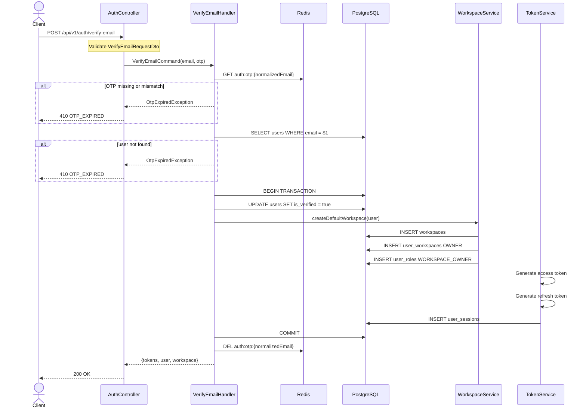

# 02 — Verify Email API Spec

> **API:** `POST /api/v1/auth/verify-email`
> **Auth:** Public
> **Mục tiêu:** Xác thực OTP, kích hoạt tài khoản, tạo workspace mặc định, cấp access token và refresh token.

---

## Tổng Quan

API verify email là bước hoàn tất onboarding sau `POST /api/v1/auth/register`.

Flow mong muốn:

1. Client gửi `email` và `otp`.
2. Hệ thống validate request body.
3. Normalize email.
4. Verify OTP từ Redis key `auth:otp:{email}`.
5. Tìm user theo email.
6. Đánh dấu `users.is_verified = true`.
7. Tạo workspace mặc định cho user.
8. Gán user làm OWNER của workspace.
9. Tạo access token và refresh token.
10. Lưu refresh session.
11. Xóa OTP khỏi Redis.
12. Trả tokens, user, workspace mặc định.

API này là nơi user chuyển từ trạng thái "đã đăng ký nhưng chưa xác thực" sang "có thể sử dụng hệ thống".

---

## 1. Sequence Diagram



---

## 2. Request

```json
{
  "email": "user@example.com",
  "otp": "123456"
}
```

| Field | Type | Required | Rule |
|-------|------|----------|------|
| `email` | string | Yes | `@IsEmail()`, `@IsNotEmpty()` |
| `otp` | string | Yes | String 6 chữ số, regex `^[0-9]{6}$` |

Không truyền `userId` vì trước verify user chưa có token. Email là identifier của flow này.

---

## 3. Response

### 200 OK

```json
{
  "message": "Email verified successfully",
  "data": {
    "accessToken": "eyJhbGciOi...",
    "refreshToken": "eyJhbGciOi...",
    "tokenType": "Bearer",
    "expiresIn": 900,
    "user": {
      "id": "018fd1e8-3c74-7f41-9fb2-78a7790d1b2a",
      "email": "user@example.com",
      "isVerified": true
    },
    "workspace": {
      "id": "2f5c3d99-5c65-4e37-a8c4-21f80b21bb9a",
      "name": "Nguyen Van's Workspace",
      "slug": "nguyen-vans-workspace",
      "membership": "OWNER"
    }
  },
  "timestamp": "2026-06-02T10:30:00.000Z",
  "path": "/api/v1/auth/verify-email",
  "method": "POST"
}
```

| Field | Type | Mô tả |
|-------|------|-------|
| `data.accessToken` | string | JWT access token |
| `data.refreshToken` | string | JWT refresh token |
| `data.tokenType` | string | Luôn là `"Bearer"` |
| `data.expiresIn` | number | Access token TTL theo giây, đề xuất `900` |
| `data.user.id` | string | User ID |
| `data.user.email` | string | Email đã normalize |
| `data.user.isVerified` | boolean | Luôn `true` |
| `data.workspace.id` | string | Workspace mặc định vừa tạo |
| `data.workspace.name` | string | Tên workspace mặc định |
| `data.workspace.slug` | string | Slug duy nhất |
| `data.workspace.membership` | string | `"OWNER"` |

---

## 4. Token Contract

### Access Token

Access token dùng để gọi API sau khi verify. Vì workspace mặc định đã được tạo ngay trong flow này, token có thể chứa `workspaceId` của workspace mặc định.

```json
{
  "sub": "user-uuid",
  "email": "user@example.com",
  "workspaceId": "workspace-uuid",
  "roles": ["WORKSPACE_OWNER"],
  "iat": 1746000000,
  "exp": 1746000900
}
```

| Claim | Mô tả |
|-------|-------|
| `sub` | User ID |
| `email` | Email user |
| `workspaceId` | Workspace mặc định vừa tạo |
| `roles` | Role của user trong workspace |
| `iat` | Issued at |
| `exp` | Expiration |

### Refresh Token

Refresh token dùng để xin access token mới. Token này phải được hash trước khi lưu DB.

```json
{
  "sub": "user-uuid",
  "jti": "refresh-token-id",
  "type": "refresh",
  "iat": 1746000000,
  "exp": 1746604800
}
```

---

## 5. Handler Steps

Implementation theo CQRS:

1. Nhận input đã validate từ API layer.
2. Normalize email.
3. Lấy OTP bằng `otpStore.getVerificationOtp(email)`.
4. Nếu OTP không tồn tại hoặc không khớp, throw `OtpExpiredException`.
5. Tìm user bằng `userRepository.findByEmail(email)`.
6. Nếu không có user, throw `OtpExpiredException`.
7. Nếu user đã verified, throw `OtpExpiredException` để tránh tạo workspace/session trùng.
8. Bắt đầu database transaction.
9. Gọi `user.markVerified()` và lưu user.
10. Lấy profile để tạo tên workspace.
11. Tạo workspace mặc định.
12. Gán membership OWNER.
13. Gán role `WORKSPACE_OWNER`.
14. Tạo access token.
15. Tạo refresh token.
16. Hash refresh token và lưu session.
17. Commit transaction.
18. Xóa OTP Redis.
19. Trả response.

OTP nên được xóa sau khi transaction thành công. Nếu DB fail giữa chừng, user vẫn còn OTP để retry.

---

## 6. Workspace Mặc Định

Workspace mặc định giúp user có môi trường làm việc ngay sau khi verify.

| Field | Rule |
|-------|------|
| `name` | `{firstName}'s Workspace`, fallback `"My Workspace"` nếu profile thiếu firstName |
| `slug` | Sinh từ name, lowercase, thay ký tự đặc biệt bằng `-` |
| `createdBy` | User ID |
| `membership` | `OWNER` |
| `role` | `WORKSPACE_OWNER` |

Nếu slug trùng, thêm suffix ngẫu nhiên, ví dụ `nguyen-vans-workspace-a1b2c3`.

---

## 7. Redis

Register lưu OTP bằng:

```ts
await redis.set(`auth:otp:${email}`, otp, 'EX', 300);
```

Verify cần mở rộng `OtpStore`:

```ts
export interface OtpStore {
  setVerificationOtp(email: string, otp: string): Promise<void>;
  getVerificationOtp(email: string): Promise<string | null>;
  deleteVerificationOtp(email: string): Promise<void>;
}
```

| Key | Operation | TTL | Mục đích |
|-----|-----------|-----|----------|
| `auth:otp:{email}` | `GET` | 300 giây | Lấy OTP để verify |
| `auth:otp:{email}` | `DEL` | - | Xóa sau khi verify thành công |

Brute-force counter có thể bổ sung sau bằng `auth:otp:fail:{email}`.

---

## 8. Database Operations

API này cần các bảng sau:

| Table | Operation | Ghi chú |
|-------|-----------|---------|
| `users` | SELECT, UPDATE | Tìm user và set `is_verified = true` |
| `profiles` | SELECT | Lấy `first_name` để đặt tên workspace |
| `workspaces` | INSERT | Tạo workspace mặc định |
| `user_workspaces` | INSERT | Gán membership OWNER |
| `roles` | SELECT | Lấy role `WORKSPACE_OWNER` |
| `user_roles` | INSERT | Gán role cho user trong workspace |
| `user_sessions` | INSERT | Lưu refresh token hash |

Các bảng workspace/session/role cần được thêm vào Prisma schema nếu chưa có.

---

## 9. Error Cases

| HTTP | Code | Trigger |
|------|------|---------|
| 400 | `VALIDATION_ERROR` | Email sai format hoặc OTP không đúng 6 chữ số |
| 410 | `OTP_EXPIRED` | OTP không tồn tại, hết hạn, sai, đã dùng, user không tồn tại, hoặc user đã verified |
| 500 | `INTERNAL_ERROR` | Tạo workspace/session/token thất bại ngoài lỗi nghiệp vụ |

`OTP_EXPIRED` gom nhiều trường hợp để tránh user enumeration.

---

## 10. Edge Cases

| Case | Cách xử lý |
|------|------------|
| OTP hết hạn | 410 `OTP_EXPIRED` |
| OTP sai | 410 `OTP_EXPIRED` |
| Email chưa đăng ký | 410 `OTP_EXPIRED` |
| User đã verify | 410 `OTP_EXPIRED`, không tạo workspace/session mới |
| Slug workspace trùng | Retry với suffix ngẫu nhiên |
| Tạo workspace/session fail | Rollback transaction, không xóa OTP |
| Refresh token hash trùng | Retry tạo `jti` mới nếu cần |

---

## 11. Side Effects

| # | Hành động | Cơ chế |
|---|-----------|--------|
| 1 | Kích hoạt user | `is_verified = true` |
| 2 | Tạo workspace mặc định | Insert `workspaces` |
| 3 | Gán OWNER membership | Insert `user_workspaces` |
| 4 | Gán role owner | Insert `user_roles` |
| 5 | Cấp access token | JWT |
| 6 | Cấp refresh token | JWT |
| 7 | Lưu session | Insert `user_sessions.refresh_token_hash` |
| 8 | Xóa OTP | `DEL auth:otp:{email}` |

---

## 12. Implementation Checklist

| # | File / Module | Việc cần làm |
|---|---------------|--------------|
| 1 | `verify-email-request.dto.ts` | DTO `email`, `otp` |
| 2 | `verify-email.command.ts` | Command |
| 3 | `verify-email.handler.ts` | Handler verify + transaction |
| 4 | `OtpStore` / `RedisOtpStore` | Thêm `GET`, `DEL` |
| 5 | `UserRepository` | Đảm bảo save user update được `is_verified` |
| 6 | `WorkspaceService` | Tạo workspace mặc định + membership OWNER |
| 7 | `TokenService` | Tạo access/refresh token |
| 8 | `SessionRepository` | Lưu refresh token hash |
| 9 | `ApiExceptionFilter` | Map `OTP_EXPIRED` -> `HttpStatus.GONE` |
| 10 | Prisma schema | Thêm workspace, role, session tables nếu chưa có |
| 11 | `AuthController` | Thêm `@Post('verify-email')` |

---

## 13. Test Scenarios

| ID | Scenario | Expected |
|----|----------|----------|
| T-V01 | Verify với email + OTP hợp lệ | 200 + tokens + workspace |
| T-V02 | OTP sai format | 400 `VALIDATION_ERROR` |
| T-V03 | Email sai format | 400 `VALIDATION_ERROR` |
| T-V04 | OTP sai nhưng đúng format | 410 `OTP_EXPIRED` |
| T-V05 | OTP hết hạn | 410 `OTP_EXPIRED` |
| T-V06 | Email chưa đăng ký | 410 `OTP_EXPIRED` |
| T-V07 | User đã verify | 410 `OTP_EXPIRED` |
| T-V08 | Verify thành công | `users.is_verified = true` |
| T-V09 | Verify thành công | Workspace mặc định được tạo |
| T-V10 | Verify thành công | User có membership OWNER |
| T-V11 | Verify thành công | User có role `WORKSPACE_OWNER` |
| T-V12 | Verify thành công | Access token có `sub`, `email`, `workspaceId` |
| T-V13 | Verify thành công | Refresh token hash được lưu trong `user_sessions` |
| T-V14 | Verify thành công | Redis OTP key bị xóa |
| T-V15 | Transaction fail | Rollback DB và không xóa OTP |
