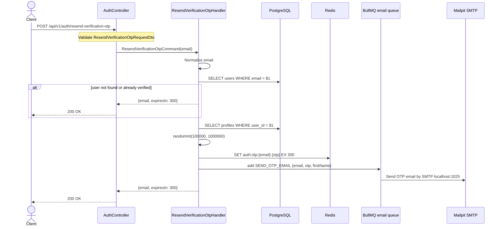

# 03 — Resend Verification OTP API Spec

> **API:** `POST /api/v1/auth/resend-verification-otp`
> **Auth:** Public
> **Mục tiêu:** Gửi lại OTP xác thực email khi OTP cũ hết hạn hoặc user cần mã mới. Không cấp token.

---

## Tổng Quan

API resend verification OTP dùng cho user đã đăng ký nhưng chưa verify email. Client gửi `email`, hệ thống normalize email, tìm user, kiểm tra trạng thái verify, sinh OTP 6 số mới, ghi đè Redis key `auth:otp:{email}` với TTL 5 phút, rồi publish job gửi email vào BullMQ queue `email`.

Endpoint này không yêu cầu access token vì user chưa verify thì chưa có token. Response trả về success generic cho cả trường hợp user không tồn tại hoặc đã verify để giảm rủi ro user enumeration.

Hiện tại controller có decorator `@Throttle({ default: { limit: 3, ttl: 60000 } })`, tức tối đa 3 request/phút cho route này khi ThrottlerGuard được bật. Trong code hiện tại `@UseGuards(ThrottlerGuard)` đang comment ở `AuthController`, nên rate limit chưa thực thi ở controller.

---

## 1. Sequence Diagram



---

## 2. Request

```json
{
  "email": "user@example.com"
}
```

| Field | Type | Required | Rule |
|-------|------|----------|------|
| `email` | string | Yes | `@IsEmail()`, `@IsNotEmpty()` |

Không truyền `otp` vì endpoint này dùng để tạo OTP mới.

---

## 3. Response

Controller gọi:

```ts
return this.responseService.success('Verification OTP resent', result);
```

Sau đó `ResponseInterceptor` gắn thêm `path` và `method`.

### 200 OK

```json
{
  "message": "Verification OTP resent",
  "data": {
    "email": "user@example.com",
    "expiresIn": 300
  },
  "timestamp": "2026-06-02T10:30:00.000Z",
  "path": "/api/v1/auth/resend-verification-otp",
  "method": "POST"
}
```

| Field | Type | Mô tả |
|-------|------|-------|
| `message` | string | `"Verification OTP resent"` |
| `data.email` | string | Email đã normalize |
| `data.expiresIn` | number | OTP TTL theo giây, hiện tại `300` |
| `timestamp` | string | ISO datetime do response DTO tạo |
| `path` | string | Request path |
| `method` | string | HTTP method |

Response không chứa OTP và không chứa token.

---

## 4. Resend Handler Steps

Code hiện tại trong `ResendVerificationOtpHandler.execute()`:

1. Nhận input đã validate từ API layer.
2. Normalize email bằng `trim().toLowerCase()`.
3. Tìm user bằng `userRepository.findByEmail(normalizedEmail)`.
4. Nếu user không tồn tại, trả success generic `{ email, expiresIn: 300 }`.
5. Nếu user đã verified, trả success generic `{ email, expiresIn: 300 }`.
6. Lấy profile bằng `profileRepository.findByUserId(user.id)` để lấy `firstName`.
7. Sinh OTP 6 số bằng `crypto.randomInt(100000, 1000000)`.
8. Ghi đè OTP Redis bằng `otpStore.setVerificationOtp(user.email, otp)`.
9. Publish job `SEND_OTP_EMAIL` vào BullMQ queue `email`.
10. Trả response `{ email, expiresIn: 300 }`.

Endpoint không xóa OTP cũ trước khi set OTP mới vì Redis `SET ... EX 300` sẽ ghi đè value và reset TTL.

---

## 5. Redis

Resend lưu OTP mới bằng:

```ts
await this.otpStore.setVerificationOtp(user.email, otp);
```

Implementation hiện tại:

```ts
await this.redis.set(`auth:otp:${email}`, otp, 'EX', 300);
```

| Key | Value | TTL | Mục đích |
|-----|-------|-----|----------|
| `auth:otp:{email}` | OTP 6 số mới | 300 giây | Verify email sau register hoặc sau resend |

Ví dụ kiểm tra OTP local:

```bash
docker exec -it node-mind-redis redis-cli GET auth:otp:user@example.com
docker exec -it node-mind-redis redis-cli TTL auth:otp:user@example.com
```

---

## 6. BullMQ + Mailpit

Queue name:

```ts
export const EMAIL_QUEUE = 'email';
```

Job name:

```ts
export const SEND_OTP_EMAIL_JOB = 'SEND_OTP_EMAIL';
```

Job payload:

```json
{
  "email": "user@example.com",
  "otp": "123456",
  "firstName": "Nguyen Van"
}
```

Producer:

```ts
await this.mailQueue.publishOtpEmail({
  email: user.email,
  otp,
  firstName: profile?.firstName ?? ''
});
```

Worker `MailProcessor` xử lý job và gọi `MailService.sendOtpEmail()`. Local SMTP dùng Mailpit:

```env
MAIL_HOST=localhost
MAIL_PORT=1025
MAIL_FROM="Node Mind <noreply@node-mind.local>"
MAILPIT_UI_PORT=8025
```

Mở Mailpit UI:

```text
http://localhost:8025
```

---

## 7. Docker Local Services

Các service local liên quan:

| Service | URL / Port | Ghi chú |
|---------|------------|---------|
| Redis | `localhost:6379` | App chạy ngoài Docker dùng host này |
| RedisInsight | `http://localhost:5540` | UI quản lý Redis |
| Mailpit SMTP | `localhost:1025` | Nodemailer gửi vào đây |
| Mailpit UI | `http://localhost:8025` | Xem email OTP |

Start services:

```bash
docker compose up -d redis redisinsight mailpit
```

---

## 8. Error Cases

### 400 Validation Error

Email sai format hoặc thiếu email:

```json
{
  "message": [
    "email must be an email",
    "email should not be empty"
  ],
  "error": "Bad Request",
  "statusCode": 400
}
```

### User Không Tồn Tại Hoặc Đã Verify

Vẫn trả `200 OK` với message `"Verification OTP resent"` và không gửi email:

```json
{
  "message": "Verification OTP resent",
  "data": {
    "email": "user@example.com",
    "expiresIn": 300
  }
}
```

Lý do: tránh để client phân biệt email đã đăng ký, chưa đăng ký, hoặc đã verify.

---

## 9. Security Notes

| Rủi ro | Cách xử lý hiện tại |
|--------|---------------------|
| User enumeration | Trả success generic khi user không tồn tại hoặc đã verify |
| OTP cũ còn hiệu lực | `SET ... EX 300` ghi đè OTP cũ và reset TTL |
| Spam email | Route có `@Throttle({ limit: 3, ttl: 60000 })`, cần bật `ThrottlerGuard` để thực thi |
| Lộ OTP qua response | Response không trả OTP |

Nên bổ sung rate limit theo email/IP ở Redis nếu endpoint này public production.

---

## 10. Implementation Checklist

| Step | File | Nội dung |
|------|------|----------|
| 1 | `resend-verification-otp-request.dto.ts` | DTO `email` |
| 2 | `resend-verification-otp.command.ts` | Command |
| 3 | `resend-verification-otp.handler.ts` | Handler resend OTP |
| 4 | `application.module.ts` | Register handler |
| 5 | `auth.controller.ts` | Thêm `@Post('resend-verification-otp')` |
| 6 | `RedisOtpStore` | Reuse `setVerificationOtp()` |
| 7 | `MailQueuePublisher` | Reuse `publishOtpEmail()` |

---

## 11. Test Cases

| ID | Case | Expected |
|----|------|----------|
| T-RO01 | Email hợp lệ, user chưa verify | 200 + Redis có OTP mới + email job được enqueue |
| T-RO02 | Email sai format | 400 `VALIDATION_ERROR` |
| T-RO03 | Thiếu email | 400 `VALIDATION_ERROR` |
| T-RO04 | Email chưa đăng ký | 200 generic, không tạo OTP, không gửi email |
| T-RO05 | User đã verify | 200 generic, không tạo OTP, không gửi email |
| T-RO06 | Resend khi OTP cũ còn hạn | OTP Redis bị ghi đè và TTL reset về gần 300 |
| T-RO07 | Resend nhiều lần vượt limit | 429 nếu `ThrottlerGuard` được bật |

---

## 12. Manual Test Local

1. Start Redis và Mailpit:

```bash
docker compose up -d redis redisinsight mailpit
```

2. Register user:

```bash
curl -X POST http://localhost:3000/api/v1/auth/register \
  -H "Content-Type: application/json" \
  -d '{"email":"user@example.com","password":"Password123!","firstName":"Nguyen Van","lastName":"A"}'
```

3. Resend OTP:

```bash
curl -X POST http://localhost:3000/api/v1/auth/resend-verification-otp \
  -H "Content-Type: application/json" \
  -d '{"email":"user@example.com"}'
```

4. Kiểm tra Redis:

```bash
docker exec -it node-mind-redis redis-cli GET auth:otp:user@example.com
docker exec -it node-mind-redis redis-cli TTL auth:otp:user@example.com
```

5. Xem email mới trong Mailpit:

```text
http://localhost:8025
```
