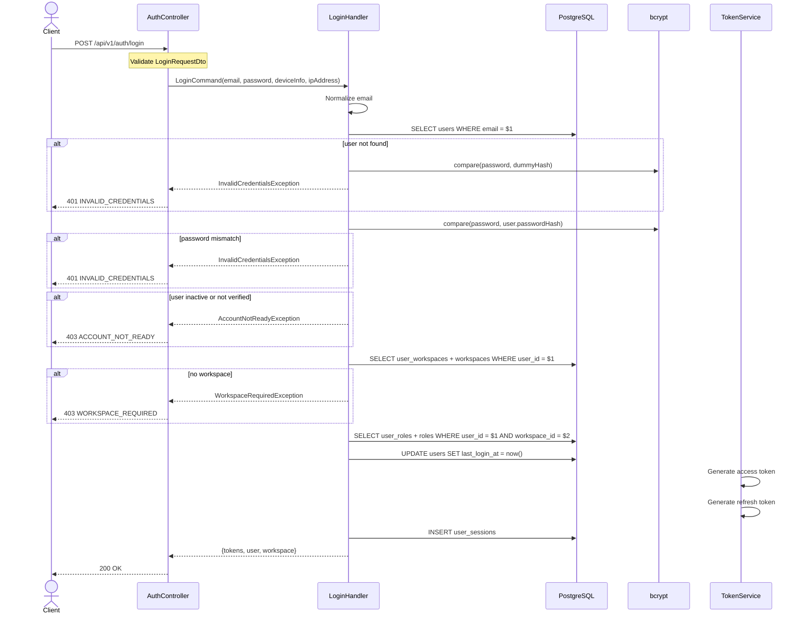

# 04 — Login API Plan

> **API:** `POST /api/v1/auth/login`
> **Auth:** Public
> **Mục tiêu:** Xác thực email/password, chỉ cho user active + verified đăng nhập, tạo session, cấp access token và refresh token.

---

## Tổng Quan

API login là bước đăng nhập sau khi user đã hoàn tất `POST /api/v1/auth/verify-email`.

Flow đề xuất cho phase hiện tại:

1. Client gửi `email`, `password`, optional `deviceInfo`.
2. Validate request body.
3. Normalize email.
4. Tìm user theo email.
5. So sánh password bằng `bcrypt.compare()`.
6. Chặn login nếu user không tồn tại, inactive, chưa verify, hoặc sai password.
7. Gọi `user.recordLogin()` và lưu `lastLoginAt`.
8. Load workspace mặc định/đầu tiên của user.
9. Load roles của user trong workspace đó.
10. Tạo access token có `workspaceId` và `roles`.
11. Tạo refresh token, hash token, lưu `user_sessions`.
12. Trả tokens, user, workspace.

Vì flow verify email hiện tại đã tạo workspace mặc định và cấp access token scoped theo workspace, login phase này cũng nên cấp token scoped vào workspace đầu tiên/default workspace để đồng bộ. API `select-workspace` có thể thêm sau khi cần user chuyển workspace.

---

## 1. Sequence Diagram



---

## 2. Request

```json
{
  "email": "user@example.com",
  "password": "Password123!",
  "deviceInfo": "Chrome 124 / macOS"
}
```

| Field | Type | Required | Rule |
|-------|------|----------|------|
| `email` | string | Yes | `@IsEmail()`, `@IsNotEmpty()` |
| `password` | string | Yes | `@IsString()`, `@IsNotEmpty()` |
| `deviceInfo` | string | No | Optional string, dùng để lưu session |

`ipAddress` không nên lấy từ body. Controller đọc từ `Request.ip` hoặc header proxy đã trust.

---

## 3. Response

Controller đề xuất:

```ts
return this.responseService.success('Login successfully', result);
```

Sau đó `ResponseInterceptor` gắn thêm `path` và `method`.

### 200 OK

```json
{
  "message": "Login successfully",
  "data": {
    "accessToken": "eyJhbGciOi...",
    "refreshToken": "eyJhbGciOi...",
    "tokenType": "Bearer",
    "expiresIn": 900,
    "user": {
      "id": "018fd1e8-3c74-7f41-9fb2-78a7790d1b2a",
      "email": "user@example.com",
      "isVerified": true,
      "mfaEnabled": false
    },
    "workspace": {
      "id": "2f5c3d99-5c65-4e37-a8c4-21f80b21bb9a",
      "name": "Nguyen Van's Workspace",
      "slug": "nguyen-vans-workspace",
      "membership": "OWNER"
    },
    "roles": ["WORKSPACE_OWNER"]
  },
  "timestamp": "2026-06-02T10:30:00.000Z",
  "path": "/api/v1/auth/login",
  "method": "POST"
}
```

| Field | Type | Mô tả |
|-------|------|-------|
| `data.accessToken` | string | JWT access token |
| `data.refreshToken` | string | JWT refresh token |
| `data.tokenType` | string | Luôn là `"Bearer"` |
| `data.expiresIn` | number | Access token TTL theo giây |
| `data.user.id` | string | User ID |
| `data.user.email` | string | Email đã normalize |
| `data.user.isVerified` | boolean | Luôn `true` khi login thành công |
| `data.user.mfaEnabled` | boolean | Dành cho phase MFA sau |
| `data.workspace` | object | Workspace context mặc định/đầu tiên |
| `data.roles` | string[] | Role codes trong workspace |

---

## 4. Token Contract

### Access Token

Login dùng lại `TokenService.generateAccessToken()` hiện tại:

```json
{
  "sub": "user-uuid",
  "email": "user@example.com",
  "workspaceId": "workspace-uuid",
  "roles": ["WORKSPACE_OWNER"],
  "iat": 1746000000,
  "exp": 1746000900
}
```

### Refresh Token

Refresh token dùng lại `TokenService.generateRefreshToken()` hiện tại:

```json
{
  "sub": "user-uuid",
  "jti": "refresh-token-id",
  "type": "refresh",
  "iat": 1746000000,
  "exp": 1746604800
}
```

Refresh token phải được hash bằng `tokenService.hashToken(refreshToken)` trước khi lưu DB.

---

## 5. Handler Steps

Implementation đề xuất theo CQRS:

1. Nhận input đã validate từ API layer.
2. Normalize email.
3. Tìm user bằng `userRepository.findByEmail(email)`.
4. Nếu user không tồn tại, chạy `bcrypt.compare(password, AUTH_DUMMY_PASSWORD_HASH)` rồi throw `InvalidCredentialsException`.
5. Nếu user tồn tại nhưng không có `passwordHash`, throw `InvalidCredentialsException`.
6. Compare password bằng `bcrypt.compare(password, user.passwordHash)`.
7. Nếu sai password, throw `InvalidCredentialsException`.
8. Nếu `user.isActive === false`, throw `AccountNotReadyException`.
9. Nếu `user.isVerified === false`, throw `AccountNotReadyException`.
10. Load workspace mặc định/đầu tiên của user.
11. Nếu không có workspace, throw `WorkspaceRequiredException`.
12. Load role codes của user trong workspace.
13. Gọi `user.recordLogin()` và `userRepository.save(user)`.
14. Tạo access token với `userId`, `email`, `workspaceId`, `roles`.
15. Tạo refresh token với `jti`.
16. Tạo `UserSession` với `refreshTokenHash`, `deviceInfo`, `ipAddress`, `expiresAt`.
17. Lưu session bằng `sessionRepository.save(session)`.
18. Trả response.

---

## 6. Repository Changes Needed

Code hiện tại đã có:

| Port | Method hiện có |
|------|----------------|
| `UserRepository` | `findByEmail()`, `save()`, `saveWithProfile()` |
| `SessionRepository` | `save()` |
| `TokenService` | `generateAccessToken()`, `generateRefreshToken()`, `hashToken()` |

Cần bổ sung cho login:

| Port | Method đề xuất | Mục đích |
|------|----------------|----------|
| `WorkspaceRepository` | `findUserWorkspaces(userId: string)` | Lấy workspace user đang thuộc về |
| `RoleRepository` | `findUserRoleCodes(userId: string, workspaceId: string)` | Lấy role codes trong workspace |

Payload gợi ý cho workspace lookup:

```ts
type UserWorkspaceView = {
  id: string;
  name: string;
  slug: string;
  membership: 'OWNER' | 'ADMIN' | 'MEMBER' | 'VIEWER';
};
```

Nếu muốn tránh mở rộng domain repository quá sớm, có thể tạo query port riêng:

```ts
export const LOGIN_CONTEXT_QUERY = Symbol('LOGIN_CONTEXT_QUERY');

export interface LoginContextQuery {
  findDefaultWorkspaceForUser(userId: string): Promise<UserWorkspaceView | null>;
  findRoleCodes(userId: string, workspaceId: string): Promise<string[]>;
}
```

Query port riêng hợp lý hơn nếu đây là read-model phục vụ login response, không phải domain behavior.

---

## 7. Database Operations

| Step | Operation |
|------|-----------|
| 1 | `SELECT users WHERE email = $1` |
| 2 | `SELECT user_workspaces JOIN workspaces WHERE user_id = $1 AND workspaces.is_active = true` |
| 3 | `SELECT user_roles JOIN roles WHERE user_id = $1 AND workspace_id = $2` |
| 4 | `UPDATE users SET last_login_at = now(), updated_at = now()` |
| 5 | `INSERT user_sessions` |

Login có thể không cần database transaction nếu sequence là:

1. Validate credentials.
2. Load context.
3. Generate tokens.
4. Save `lastLoginAt`.
5. Save session.

Nếu muốn đảm bảo `lastLoginAt` và session cùng commit, tạo unit-of-work riêng cho login.

---

## 8. Redis & Rate Limit

Login cần env sau để chống timing attack khi email không tồn tại:

```env
AUTH_DUMMY_PASSWORD_HASH=$2a$12$C6UzMDM.H6dfI/f/IKcEe.6xCZDglKJ5f0Y4L0S6xBfgL84bF6gqG
```

Hash này là bcrypt hash giả, dùng để `bcrypt.compare()` có chi phí tương đương trường hợp user tồn tại. App nên fail fast nếu thiếu env này.

Phase đầu có thể chưa implement Redis login fail counter, nhưng nên có trong plan:

| Key | TTL | Mục đích |
|-----|-----|----------|
| `auth:login:fail:{email}` | 900 giây | Đếm số lần sai password theo email |
| `auth:login:lock:{email}` | 900 giây | Khóa login tạm thời nếu vượt số lần sai |

Rule đề xuất:

1. Sai password: increment `auth:login:fail:{email}`.
2. Nếu fail count >= 5: set lock 15 phút.
3. Login thành công: delete fail counter và lock key.

Có thể implement sau resend/register/verify ổn định. Controller vẫn nên có throttle:

```ts
@Throttle({ default: { limit: 5, ttl: 60000 } })
```

---

## 9. Error Cases

| HTTP | Code | Condition |
|------|------|-----------|
| 400 | `VALIDATION_ERROR` | Email/password thiếu hoặc sai format |
| 401 | `INVALID_CREDENTIALS` | User không tồn tại, không có password hash, hoặc sai password |
| 403 | `ACCOUNT_NOT_READY` | User inactive hoặc chưa verify email |
| 403 | `WORKSPACE_REQUIRED` | User verified nhưng không có workspace active |
| 429 | `RATE_LIMIT_EXCEEDED` | Vượt throttle hoặc login fail lock |

`INVALID_CREDENTIALS` nên gom user không tồn tại và sai password để tránh user enumeration.

---

## 10. Edge Cases

| Case | Expected |
|------|----------|
| Email chưa đăng ký | 401 `INVALID_CREDENTIALS` |
| Password sai | 401 `INVALID_CREDENTIALS` |
| User chưa verify | 403 `ACCOUNT_NOT_READY` |
| User inactive | 403 `ACCOUNT_NOT_READY` |
| User OAuth-only không có password hash | 401 `INVALID_CREDENTIALS` hoặc yêu cầu social login |
| User không có workspace | 403 `WORKSPACE_REQUIRED` |
| User có nhiều workspace | Chọn workspace đầu tiên/default, phase sau dùng `select-workspace` |
| Role rỗng | Trả `roles: []`, nhưng nên điều tra dữ liệu |

---

## 11. Implementation Checklist

| Step | File | Nội dung |
|------|------|----------|
| 1 | `login-request.dto.ts` | DTO `email`, `password`, `deviceInfo` |
| 2 | `login.command.ts` | Command |
| 3 | `login.handler.ts` | Handler login |
| 4 | `invalid-credentials.exception.ts` | 401 credentials error |
| 5 | `account-not-ready.exception.ts` | 403 inactive/unverified |
| 6 | `workspace-required.exception.ts` | 403 missing workspace |
| 7 | `api-exception.filter.ts` | Map error codes sang HTTP status |
| 8 | `login-context-query.port.ts` | Read model port lấy workspace + roles |
| 9 | `prisma-login-context.query.ts` | Prisma implementation |
| 10 | `application.module.ts` | Register `LoginHandler` |
| 11 | `auth.controller.ts` | Thêm `@Post('login')` |
| 12 | `postman.md` | Thêm request Login sau khi implement |

---

## 12. Test Scenarios

| ID | Case | Expected |
|----|------|----------|
| T-L01 | Login đúng email/password, user verified | 200 + tokens + workspace + roles |
| T-L02 | Email sai format | 400 `VALIDATION_ERROR` |
| T-L03 | Thiếu password | 400 `VALIDATION_ERROR` |
| T-L04 | Email chưa đăng ký | 401 `INVALID_CREDENTIALS` |
| T-L05 | Password sai | 401 `INVALID_CREDENTIALS` |
| T-L06 | User chưa verify | 403 `ACCOUNT_NOT_READY` |
| T-L07 | User inactive | 403 `ACCOUNT_NOT_READY` |
| T-L08 | User không có workspace | 403 `WORKSPACE_REQUIRED` |
| T-L09 | Login thành công | `lastLoginAt` được cập nhật |
| T-L10 | Login thành công | `user_sessions` có refresh token hash |
| T-L11 | Login thành công | Access token có `sub`, `email`, `workspaceId`, `roles` |

---

## 13. Manual Test Local

1. Register user:

```bash
curl -X POST http://localhost:3000/api/v1/auth/register \
  -H "Content-Type: application/json" \
  -d '{"email":"user@example.com","password":"Password123!","firstName":"Nguyen Van","lastName":"A"}'
```

2. Verify email bằng OTP mới nhất.

3. Login:

```bash
curl -X POST http://localhost:3000/api/v1/auth/login \
  -H "Content-Type: application/json" \
  -d '{"email":"user@example.com","password":"Password123!","deviceInfo":"curl local"}'
```
