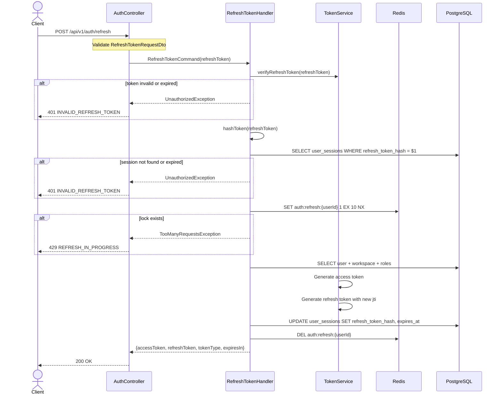

# 05 — Refresh Token API Plan

> **API:** `POST /api/v1/auth/refresh`
> **Auth:** Public với refresh token hợp lệ
> **Status:** Implemented
> **Mục tiêu:** Cấp access token mới khi access token hết hạn, rotate refresh token, và cập nhật session để chống replay attack.

---

## Tổng Quan

API refresh token là bước duy trì phiên đăng nhập sau khi access token hết hạn. Client gửi refresh token hiện tại, server xác thực token và session tương ứng, sau đó cấp access token mới cùng refresh token mới.

Flow đề xuất cho phase hiện tại:

1. Client gửi `refreshToken`.
2. Validate request body.
3. Verify JWT refresh token bằng `JWT_REFRESH_SECRET`.
4. Kiểm tra payload có `sub`, `jti`, và `type = refresh`.
5. Hash raw refresh token bằng `TokenService.hashToken()`.
6. Tìm `user_sessions` theo `refreshTokenHash`.
7. Kiểm tra session tồn tại, đúng `userId`, và chưa hết hạn.
8. Đặt Redis lock theo `auth:refresh:{userId}` để chống race condition.
9. Load user, workspace mặc định/đầu tiên, và roles giống login.
10. Generate access token mới.
11. Generate refresh token mới với `jti` mới.
12. Hash refresh token mới và cập nhật session.
13. Xóa Redis lock và trả tokens.

Refresh token phải được rotate mỗi lần sử dụng. Nếu client dùng lại refresh token cũ sau khi rotate, hash cũ không còn khớp session và API phải trả `401`.

---

## 1. Sequence Diagram



---

## 2. Request

```json
{
  "refreshToken": "eyJhbGciOi..."
}
```

| Field | Type | Required | Rule |
|-------|------|----------|------|
| `refreshToken` | string | Yes | `@IsString()`, `@IsNotEmpty()` |

Endpoint này không dùng access token guard vì access token có thể đã hết hạn. Refresh token chỉ gửi trong body ở phase hiện tại.

---

## 3. Response

Controller đề xuất:

```ts
return this.responseService.success('Token refreshed successfully', result);
```

Sau đó `ResponseInterceptor` gắn thêm `path` và `method`.

### 200 OK

```json
{
  "message": "Token refreshed successfully",
  "data": {
    "accessToken": "eyJhbGciOi...",
    "refreshToken": "eyJhbGciOi...",
    "tokenType": "Bearer",
    "expiresIn": 900
  },
  "timestamp": "2026-06-02T10:30:00.000Z",
  "path": "/api/v1/auth/refresh",
  "method": "POST"
}
```

| Field | Type | Note |
|-------|------|------|
| `data.accessToken` | string | JWT access token mới |
| `data.refreshToken` | string | JWT refresh token mới sau rotation |
| `data.tokenType` | string | Luôn là `"Bearer"` |
| `data.expiresIn` | number | Access token TTL theo giây |

---

## 4. Token Rules

### Access Token Mới

Access token mới dùng cùng claim format với login:

```json
{
  "sub": "user-uuid",
  "email": "user@example.com",
  "workspaceId": "workspace-uuid",
  "roles": ["OWNER"],
  "iat": 1717300000,
  "exp": 1717300900
}
```

### Refresh Token Mới

Refresh token mới phải có `jti` mới:

```json
{
  "sub": "user-uuid",
  "jti": "new-refresh-token-id",
  "type": "refresh",
  "iat": 1717300000,
  "exp": 1719892000
}
```

Refresh token mới phải được hash bằng `tokenService.hashToken(refreshToken)` trước khi lưu DB.

---

## 5. Required Code Changes

| # | File | Change |
|---|------|--------|
| 1 | `refresh-token-request.dto.ts` | DTO request body |
| 2 | `refresh-token.command.ts` | Command nhận raw refresh token |
| 3 | `refresh-token.handler.ts` | Handler xử lý verify, session check, rotation |
| 4 | `token-service.port.ts` | Thêm `verifyRefreshToken()` |
| 5 | `jwt-token.service.ts` | Implement verify refresh token bằng `JWT_REFRESH_SECRET` |
| 6 | `session-repository.interface.ts` | Thêm find/update cho refresh token |
| 7 | `prisma-session.repository.ts` | Query session theo hash và rotate token |
| 8 | `user-session.entity.ts` | Thêm `isExpired()` và rotate behavior |
| 9 | `application.module.ts` | Register `RefreshTokenHandler` |
| 10 | `auth.controller.ts` | Thêm `@Post('refresh')` |

---

## 6. Repository Contract Đề Xuất

```ts
export interface SessionRepository {
  save(session: UserSession): Promise<void>;
  findByRefreshTokenHash(hash: string): Promise<UserSession | null>;
  rotateRefreshToken(
    sessionId: string,
    refreshTokenHash: string,
    expiresAt: Date,
  ): Promise<void>;
}
```

Phase đầu chưa cần `revokedAt`. Khi triển khai logout/logout-all, nên bổ sung field revoke thay vì chỉ xóa session.

---

## 7. Handler Flow Chi Tiết

1. Gọi `tokenService.verifyRefreshToken(command.refreshToken)`.
2. Nếu verify fail, trả `401 INVALID_REFRESH_TOKEN`.
3. Hash raw token.
4. Tìm session theo hash.
5. Nếu session không tồn tại, trả `401 INVALID_REFRESH_TOKEN`.
6. Nếu `session.userId !== payload.sub`, trả `401 INVALID_REFRESH_TOKEN`.
7. Nếu session hết hạn, trả `401 INVALID_REFRESH_TOKEN`.
8. Đặt Redis lock `auth:refresh:{userId}` với TTL 10 giây và option `NX`.
9. Nếu lock không đặt được, trả `429 REFRESH_IN_PROGRESS`.
10. Load user và đảm bảo user vẫn active + verified.
11. Load workspace mặc định/đầu tiên và roles giống login.
12. Generate access token mới.
13. Generate refresh token mới với `randomUUID()` làm `jti`.
14. Update session với refresh token hash mới và `expiresAt` mới.
15. Xóa Redis lock trong `finally`.
16. Trả response.

---

## 8. Redis Keys

| Key | Value | TTL | Mục đích |
|-----|-------|-----|----------|
| `auth:refresh:{userId}` | `1` | 10 giây | Chặn nhiều request refresh song song |

Lock phải được xóa trong `finally`. Nếu process chết giữa chừng, TTL 10 giây sẽ tự giải phóng lock.

---

## 9. Error Handling

| HTTP | Code | Trường hợp |
|------|------|------------|
| 400 | `VALIDATION_ERROR` | Body thiếu hoặc sai `refreshToken` |
| 401 | `INVALID_REFRESH_TOKEN` | JWT invalid, expired, sai type, session không tồn tại, session expired, hoặc token đã bị rotate |
| 403 | `ACCOUNT_NOT_READY` | User inactive hoặc chưa verified |
| 403 | `WORKSPACE_REQUIRED` | User không có workspace để tạo access token |
| 429 | `REFRESH_IN_PROGRESS` | Đang có request refresh khác cho user |
| 500 | `INTERNAL_ERROR` | Lỗi ngoài nghiệp vụ |

Không nên phân biệt chi tiết giữa token invalid, session missing, token reused trong response public. Dùng chung `INVALID_REFRESH_TOKEN` để giảm rủi ro leak thông tin.

---

## 10. Security Notes

1. Không lưu raw refresh token trong DB.
2. Refresh token phải rotate mỗi lần sử dụng.
3. Refresh token cũ sau rotation phải không dùng lại được.
4. Không cấp access token nếu user hiện đã inactive hoặc chưa verified.
5. Không lấy `userId` từ request body.
6. Không dùng access token expired để xác định user trong refresh flow.
7. Redis lock chỉ dùng để chống race condition, không thay thế DB session check.

---

## 11. Database Notes

Schema hiện tại có:

```prisma
model UserSession {
  id               String   @id @default(uuid()) @db.Uuid
  userId           String   @map("user_id") @db.Uuid
  refreshTokenHash String   @map("refresh_token_hash")
  deviceInfo       String?  @map("device_info")
  ipAddress        String?  @map("ip_address") @db.VarChar(45)
  expiresAt        DateTime @map("expires_at") @db.Timestamptz(6)
  createdAt        DateTime @default(now()) @map("created_at") @db.Timestamptz(6)
}
```

Phase đầu có thể update trực tiếp `refreshTokenHash` và `expiresAt`.

Đề xuất migration sau khi cần logout/revoke đầy đủ:

| Field | Type | Mục đích |
|-------|------|----------|
| `revokedAt` | `DateTime?` | Đánh dấu session đã logout/revoke |
| `updatedAt` | `DateTime` | Theo dõi lần rotate gần nhất |

Index đề xuất:

```prisma
@@index([refreshTokenHash], map: "idx_sessions_refresh_token_hash")
```

Nếu muốn đảm bảo không có hash trùng, dùng unique index. Vì token JWT có `jti` ngẫu nhiên và hash SHA-256, khả năng trùng rất thấp.

---

## 12. Test Cases

| ID | Case | Expected |
|----|------|----------|
| T-RT01 | Refresh token hợp lệ | 200 + accessToken mới + refreshToken mới |
| T-RT02 | Thiếu refreshToken | 400 |
| T-RT03 | Refresh token invalid signature | 401 |
| T-RT04 | Refresh token expired | 401 |
| T-RT05 | Token type không phải `refresh` | 401 |
| T-RT06 | Session không tồn tại | 401 |
| T-RT07 | Session đã hết hạn | 401 |
| T-RT08 | Dùng lại refresh token cũ sau rotation | 401 |
| T-RT09 | User inactive hoặc chưa verified | 403 |
| T-RT10 | User không có workspace | 403 |
| T-RT11 | Redis lock đang tồn tại | 429 |
| T-RT12 | Refresh thành công | DB session có refresh token hash mới |

---

## 13. Curl Example

```bash
curl -X POST http://localhost:3000/api/v1/auth/refresh \
  -H "Content-Type: application/json" \
  -d '{
    "refreshToken": "eyJhbGciOi..."
  }'
```

Expected response:

```json
{
  "message": "Token refreshed successfully",
  "data": {
    "accessToken": "eyJhbGciOi...",
    "refreshToken": "eyJhbGciOi...",
    "tokenType": "Bearer",
    "expiresIn": 900
  }
}
```
