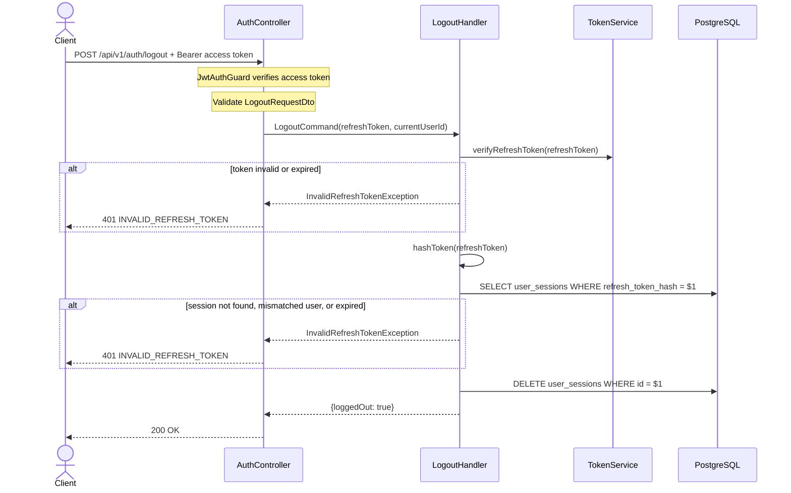

# 06 — Logout API Plan

> **API:** `POST /api/v1/auth/logout`
> **Auth:** Bearer access token + refresh token hợp lệ
> **Status:** Implemented
> **Mục tiêu:** Đăng xuất một phiên hiện tại bằng cách invalid refresh token tương ứng trong `user_sessions`.

---

## Tổng Quan

API logout yêu cầu user đang đăng nhập bằng `Authorization: Bearer <accessToken>` và dùng refresh token để xác định session cần đăng xuất. Server verify access token, verify refresh token, hash raw refresh token, tìm session đang lưu trong DB, kiểm tra session thuộc cùng user đang đăng nhập, sau đó xóa session đó.

Flow hiện tại:

1. Client gửi `Authorization: Bearer <accessToken>` và `refreshToken`.
2. Verify JWT access token bằng `JWT_SECRET`.
3. Validate request body.
4. Verify JWT refresh token bằng `JWT_REFRESH_SECRET`.
5. Kiểm tra payload có `sub`, `jti`, và `type = refresh`.
6. Hash raw refresh token bằng `TokenService.hashToken()`.
7. Tìm `user_sessions` theo `refreshTokenHash`.
8. Kiểm tra session tồn tại, đúng refresh token `sub`, đúng access token user, và chưa hết hạn.
9. Xóa session khỏi `user_sessions`.
10. Trả trạng thái logout thành công.

Sau khi logout thành công, refresh token đó không còn dùng được cho `POST /api/v1/auth/refresh`.

---

## 1. Sequence Diagram



---

## 2. Request

```json
{
  "refreshToken": "eyJhbGciOi..."
}
```

| Field | Type | Required | Rule |
|-------|------|----------|------|
| `refreshToken` | string | Yes | `@IsString()`, `@IsNotEmpty()` |

Endpoint này yêu cầu `Authorization: Bearer <accessToken>`. Refresh token vẫn gửi trong body để server xóa đúng session. Nếu access token thiếu/sai/hết hạn, API trả `401 AUTHENTICATION_ERROR`. Nếu refresh token không hợp lệ hoặc không thuộc cùng user với access token, API trả `401 INVALID_REFRESH_TOKEN`.

---

## 3. Response

Controller:

```ts
return this.responseService.success('Logout successfully', result);
```

Sau đó `ResponseInterceptor` gắn thêm `path` và `method`.

### 200 OK

```json
{
  "message": "Logout successfully",
  "data": {
    "loggedOut": true
  },
  "timestamp": "2026-06-02T10:30:00.000Z",
  "path": "/api/v1/auth/logout",
  "method": "POST"
}
```

| Field | Type | Note |
|-------|------|------|
| `data.loggedOut` | boolean | `true` khi session đã bị xóa |

---

## 4. Required Code Changes

| # | File | Change |
|---|------|--------|
| 1 | `logout-request.dto.ts` | DTO request body |
| 2 | `jwt-auth.guard.ts` | Guard verify Bearer access token |
| 3 | `logout.command.ts` | Command nhận raw refresh token và current user id |
| 4 | `logout.handler.ts` | Handler verify token, session check, xóa session |
| 5 | `session-repository.interface.ts` | Thêm `deleteById()` |
| 6 | `prisma-session.repository.ts` | Implement xóa session theo id |
| 7 | `application.module.ts` | Register `LogoutHandler` |
| 8 | `auth.controller.ts` | Thêm `@Post('logout')` và `@UseGuards(JwtAuthGuard)` |

---

## 5. Repository Contract

```ts
export interface SessionRepository {
  save(session: UserSession): Promise<void>;
  findByRefreshTokenHash(hash: string): Promise<UserSession | null>;
  rotateRefreshToken(
    sessionId: string,
    refreshTokenHash: string,
    expiresAt: Date,
  ): Promise<void>;
  deleteById(sessionId: string): Promise<void>;
}
```

Phase hiện tại xóa session trực tiếp. Khi cần audit trail hoặc logout-all nâng cao, có thể thêm `revokedAt` thay vì delete hard.

---

## 6. Handler Flow Chi Tiết

1. Guard verify Bearer access token và gán `request.user`.
2. Controller truyền `currentUserId` từ access token vào command.
3. Gọi `tokenService.verifyRefreshToken(command.refreshToken)`.
4. Nếu verify fail, trả `401 INVALID_REFRESH_TOKEN`.
5. Hash raw token.
6. Tìm session theo hash.
7. Nếu session không tồn tại, trả `401 INVALID_REFRESH_TOKEN`.
8. Nếu `session.userId !== payload.sub`, trả `401 INVALID_REFRESH_TOKEN`.
9. Nếu `session.userId !== command.currentUserId`, trả `401 INVALID_REFRESH_TOKEN`.
10. Nếu session hết hạn, trả `401 INVALID_REFRESH_TOKEN`.
11. Gọi `sessionRepository.deleteById(session.id)`.
12. Trả `{ loggedOut: true }`.

---

## 7. Error Handling

| HTTP | Code | Trường hợp |
|------|------|------------|
| 400 | `VALIDATION_ERROR` | Body thiếu hoặc sai `refreshToken` |
| 401 | `AUTHENTICATION_ERROR` | Bearer access token thiếu, sai format, invalid, hoặc hết hạn |
| 401 | `INVALID_REFRESH_TOKEN` | JWT invalid, expired, sai type, session không tồn tại, session expired, token đã logout, hoặc refresh token không thuộc user đang đăng nhập |
| 500 | `INTERNAL_ERROR` | Lỗi ngoài nghiệp vụ |

Không nên phân biệt refresh token invalid với session đã bị logout trong response. Dùng chung `INVALID_REFRESH_TOKEN`.

---

## 8. Security Notes

1. Không lưu raw refresh token trong DB.
2. Không lấy `userId` từ request body.
3. Chỉ logout session khớp với refresh token hash và cùng user với Bearer access token.
4. Logout hiện tại invalid refresh token/session, chưa blacklist access token đang còn hạn.
5. Client phải xóa access token và refresh token khỏi local storage/cookie sau khi logout thành công.

---

## 9. Test Cases

| ID | Case | Expected |
|----|------|----------|
| T-LO01 | Refresh token hợp lệ | 200 + `loggedOut=true` |
| T-LO02 | Thiếu refreshToken | 400 |
| T-LO03 | Refresh token invalid signature | 401 |
| T-LO04 | Refresh token expired | 401 |
| T-LO05 | Token type không phải `refresh` | 401 |
| T-LO06 | Session không tồn tại | 401 |
| T-LO07 | Session đã hết hạn | 401 |
| T-LO08 | Thiếu Bearer access token | 401 |
| T-LO09 | Refresh token thuộc user khác Bearer token | 401 |
| T-LO10 | Logout xong gọi refresh bằng token cũ | 401 |

---

## 10. Curl Example

```bash
curl -X POST http://localhost:3000/api/v1/auth/logout \
  -H "Authorization: Bearer eyJhbGciOi..." \
  -H "Content-Type: application/json" \
  -d '{
    "refreshToken": "eyJhbGciOi..."
  }'
```

Expected response:

```json
{
  "message": "Logout successfully",
  "data": {
    "loggedOut": true
  }
}
```
