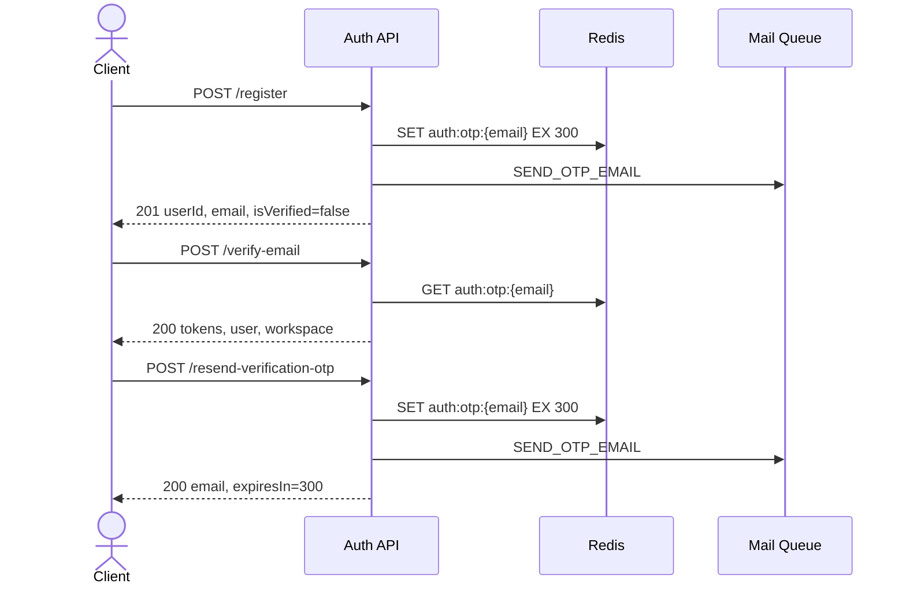

# Auth API Index

> Danh sách API auth đã triển khai trong code hiện tại.

---

## Base Information

| Key | Value |
|-----|-------|
| Base URL | `/api/v1/auth` |
| Auth hiện tại | Public cho 3 API onboarding |
| Content-Type | `application/json` |
| OTP TTL | 300 giây |
| Local Mail UI | `http://localhost:8025` |

---

## Implemented APIs

| # | API | Method | Path | Auth | Status | Spec |
|---|-----|--------|------|------|--------|------|
| 1 | Register | POST | `/api/v1/auth/register` | Public | Implemented | [01-register-api.md](./01-register-api.md) |
| 2 | Verify Email | POST | `/api/v1/auth/verify-email` | Public | Implemented | [02-verify-email-api.md](./02-verify-email-api.md) |
| 3 | Resend Verification OTP | POST | `/api/v1/auth/resend-verification-otp` | Public | Implemented | [03-resend-verification-otp-api.md](./03-resend-verification-otp-api.md) |

---

## Quick Flow



---

## Local Test Order

1. Start local services:

```bash
docker compose up -d redis redisinsight mailpit
```

2. Start API server:

```bash
pnpm start:dev
```

3. Call `POST /api/v1/auth/register`.
4. Read OTP from Mailpit or Redis.
5. Call `POST /api/v1/auth/verify-email`.
6. If OTP expired, call `POST /api/v1/auth/resend-verification-otp`.

---

## Related Docs

| File | Mô tả |
|------|------|
| [api.md](./api.md) | Kế hoạch tổng thể và roadmap auth API |
| [postman.md](./postman.md) | Hướng dẫn test 3 API bằng Postman |
| [node-mind-auth.postman_collection.json](./node-mind-auth.postman_collection.json) | Collection import trực tiếp vào Postman |
| [database.md](./database.md) | Database, Redis key, auth flow nền |
