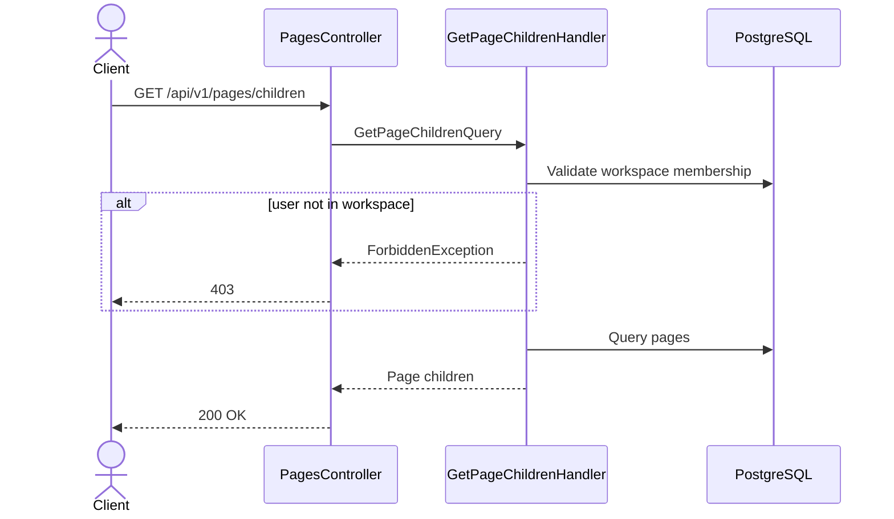

# 02 — Get Page Children API Spec

> **API:** `GET /api/v1/pages/children`
> **Auth:** Required
> **Module:** Notes
> **Mục tiêu:** Lấy danh sách page con theo parent page. API này được sử dụng để render sidebar tree theo cơ chế lazy loading.

---

## Tổng Quan

Node Mind không tải toàn bộ cây thư mục của workspace.

Sidebar hoạt động theo cơ chế lazy loading:

1. Load root pages.
2. User expand page.
3. Client gọi API lấy children.
4. Render subtree.

Cách này giúp workspace có thể chứa hàng nghìn page mà vẫn hoạt động tốt.

---

## 1. Sequence Diagram



---

## 2. Request

### Root Pages

```http
GET /api/v1/pages/children?workspaceId=workspace-id&parentId=root&limit=50
```

### Child Pages

```http
GET /api/v1/pages/children?workspaceId=workspace-id&parentId=page-id&limit=50
```

### Query Parameters

| Field       | Type   | Required | Description        |
| ----------- | ------ | -------- | ------------------ | ------------------ |
| workspaceId | UUID   | Yes      | Workspace hiện tại |
| parentId    | UUID   | root     | Yes                | Page cha hoặc root |
| limit       | number | No       | Default = 50       |
| cursor      | string | No       | Cursor pagination  |

---

## 3. Response

### 200 OK

```json
{
  "message": "Pages retrieved successfully",
  "data": [
    {
      "id": "page-1",
      "title": "Backend",
      "icon": "🧠",
      "parentId": null,
      "hasChildren": true,
      "orderIndex": 0,
      "updatedAt": "2026-06-03T10:30:00.000Z"
    },
    {
      "id": "page-2",
      "title": "Frontend",
      "icon": "🎨",
      "parentId": null,
      "hasChildren": false,
      "orderIndex": 1,
      "updatedAt": "2026-06-03T10:30:00.000Z"
    }
  ],
  "meta": {
    "limit": 50,
    "hasMore": false,
    "nextCursor": null
  },
  "timestamp": "2026-06-03T10:30:00.000Z",
  "path": "/api/v1/pages/children",
  "method": "GET"
}
```

---

## 4. Response Fields

### Page Item

| Field       | Type     | Description           |
| ----------- | -------- | --------------------- | ----------- |
| id          | UUID     | Page id               |
| title       | string   | Page title            |
| icon        | string   | null                  | Page icon   |
| parentId    | UUID     | null                  | Parent page |
| hasChildren | boolean  | Có page con hay không |
| orderIndex  | number   | Sidebar order         |
| updatedAt   | ISO Date | Last modified         |

### Meta

| Field      | Type    | Description |
| ---------- | ------- | ----------- | ---------------- |
| limit      | number  | Page size   |
| hasMore    | boolean | Còn dữ liệu |
| nextCursor | string  | null        | Cursor tiếp theo |

---

## 5. Query Logic

### Root Pages

```sql
SELECT *
FROM pages
WHERE workspace_id = $1
  AND parent_id IS NULL
  AND is_deleted = false
ORDER BY order_index ASC
LIMIT $2;
```

### Child Pages

```sql
SELECT *
FROM pages
WHERE workspace_id = $1
  AND parent_id = $2
  AND is_deleted = false
ORDER BY order_index ASC
LIMIT $3;
```

---

## 6. Has Children Calculation

Để tránh N+1 query.

```sql
EXISTS (
  SELECT 1
  FROM pages children
  WHERE children.parent_id = page.id
    AND children.is_deleted = false
)
```

Response:

```json
{
  "hasChildren": true
}
```

Frontend dùng field này để render:

```text
▶ Backend
```

hoặc

```text
📄 NestJS
```

---

## 7. Pagination Strategy

### Phase 1

Offset-free cursor pagination.

Request:

```http
GET /api/v1/pages/children
?workspaceId=workspace-id
&parentId=root
&limit=50
&cursor=page-id
```

Response:

```json
{
  "meta": {
    "hasMore": true,
    "nextCursor": "page-id-50"
  }
}
```

---

## 8. Repository Contract

```ts
findRootPages(params: {
  workspaceId: string;
  limit: number;
  cursor?: string;
}): Promise<Page[]>;

findChildren(params: {
  workspaceId: string;
  parentId: string;
  limit: number;
  cursor?: string;
}): Promise<Page[]>;
```

---

## 9. Error Cases

### 400 VALIDATION_ERROR

```json
{
  "message": "Validation failed"
}
```

Invalid UUID.

---

### 401 UNAUTHORIZED

```json
{
  "message": "Unauthorized"
}
```

Missing token.

---

### 403 WORKSPACE_ACCESS_DENIED

```json
{
  "message": "You do not have access to this workspace."
}
```

User không thuộc workspace.

---

## 10. Test Scenarios

| ID     | Scenario                | Expected        |
| ------ | ----------------------- | --------------- |
| T-PC01 | Load root pages         | 200             |
| T-PC02 | Load children page      | 200             |
| T-PC03 | Empty folder            | data=[]         |
| T-PC04 | Parent page not found   | 200 + empty     |
| T-PC05 | Workspace invalid       | 403             |
| T-PC06 | Missing token           | 401             |
| T-PC07 | limit = 50              | max 50 records  |
| T-PC08 | hasChildren calculation | đúng            |
| T-PC09 | Cursor pagination       | nextCursor đúng |
| T-PC10 | Deleted pages           | không xuất hiện |

---

## 11. Technical Notes

- Sidebar sử dụng lazy loading.
- Không load full tree.
- Không trả blocks.
- Không trả page content.
- Chỉ trả metadata phục vụ sidebar.
- Hỗ trợ workspace có hàng chục nghìn page.
- Đây là API được gọi nhiều nhất trong Notes Module.
