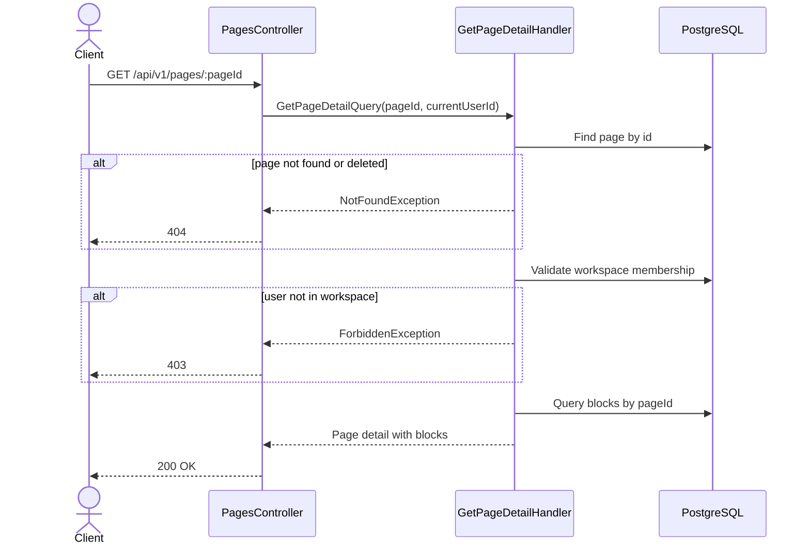

# 03 — Get Page Detail API Spec

> **API:** `GET /api/v1/pages/:pageId`
> **Auth:** Required
> **Module:** Notes
> **Mục tiêu:** Lấy chi tiết một page để mở editor, bao gồm metadata của page và danh sách blocks.

---

## Tổng Quan

API này được gọi khi user click vào một page trong sidebar.

Khác với API `GET /api/v1/pages/children`, API này không dùng để render tree.
Nó dùng để mở nội dung chính của page trong editor.

API trả về:

1. Metadata của page.
2. Danh sách blocks thuộc page.
3. Blocks được sort theo `orderIndex`.

---

## 1. Endpoint

```http
GET /api/v1/pages/:pageId
```

Example:

```http
GET /api/v1/pages/page-uuid
```

---

## 2. Sequence Diagram



---

## 3. Request

### Path Parameters

| Field  | Type | Required | Description           |
| ------ | ---- | -------- | --------------------- |
| pageId | UUID | Yes      | Page cần lấy chi tiết |

---

## 4. Response

### 200 OK

```json
{
  "message": "Page retrieved successfully",
  "data": {
    "id": "page-uuid",
    "workspaceId": "workspace-uuid",
    "parentId": null,
    "title": "NestJS Notes",
    "icon": "🧠",
    "coverUrl": "https://example.com/cover.png",
    "orderIndex": 0,
    "isArchived": false,
    "isDeleted": false,
    "createdAt": "2026-06-03T10:30:00.000Z",
    "updatedAt": "2026-06-03T10:30:00.000Z",
    "blocks": [
      {
        "id": "block-uuid-1",
        "pageId": "page-uuid",
        "type": "paragraph",
        "content": {
          "text": "Hello Node Mind"
        },
        "orderIndex": 0,
        "createdAt": "2026-06-03T10:30:00.000Z",
        "updatedAt": "2026-06-03T10:30:00.000Z"
      }
    ]
  },
  "timestamp": "2026-06-03T10:30:00.000Z",
  "path": "/api/v1/pages/page-uuid",
  "method": "GET"
}
```

---

## 5. Response Fields

### Page Detail

| Field       | Type        | Description                 |
| ----------- | ----------- | --------------------------- |
| id          | UUID        | Page id                     |
| workspaceId | UUID        | Workspace chứa page         |
| parentId    | UUID/null   | Page cha, null nếu là root  |
| title       | string      | Tiêu đề page                |
| icon        | string/null | Icon của page               |
| coverUrl    | string/null | Cover image                 |
| orderIndex  | number      | Thứ tự trong sidebar        |
| isArchived  | boolean     | Page đã archive hay chưa    |
| isDeleted   | boolean     | Page đã vào trash hay chưa  |
| createdAt   | ISO Date    | Thời điểm tạo               |
| updatedAt   | ISO Date    | Thời điểm cập nhật          |
| blocks      | array       | Danh sách blocks trong page |

### Block Item

| Field      | Type     | Description              |
| ---------- | -------- | ------------------------ |
| id         | UUID     | Block id                 |
| pageId     | UUID     | Page chứa block          |
| type       | string   | Loại block               |
| content    | object   | Nội dung block dạng JSON |
| orderIndex | number   | Thứ tự block trong page  |
| createdAt  | ISO Date | Thời điểm tạo            |
| updatedAt  | ISO Date | Thời điểm cập nhật       |

---

## 6. Query Logic

```sql
SELECT *
FROM pages
WHERE id = $1
  AND is_deleted = false
LIMIT 1;
```

Sau đó lấy blocks:

```sql
SELECT *
FROM blocks
WHERE page_id = $1
ORDER BY order_index ASC, created_at ASC;
```

---

## 7. Business Rules

1. Page phải tồn tại.
2. Page không được có `isDeleted = true`.
3. User phải là member của workspace chứa page.
4. Blocks phải được sort theo `orderIndex ASC`, sau đó `createdAt ASC`.
5. API này không trả children pages.
6. API này không dùng để render sidebar.
7. Nếu page đang archived, Phase 1 có thể vẫn cho mở detail nếu user biết URL.
8. Nếu muốn chặt hơn, có thể chặn archived page và trả `404`.

---

## 8. Repository Contract

```ts
findDetailById(pageId: string): Promise<PageDetail | null>;

findBlocksByPageId(pageId: string): Promise<Block[]>;
```

Hoặc gộp:

```ts
findPageWithBlocks(pageId: string): Promise<PageDetail | null>;
```

Recommended cho Prisma:

```ts
const page = await prisma.page.findFirst({
  where: {
    id: pageId,
    isDeleted: false,
  },
  include: {
    blocks: {
      orderBy: [{ orderIndex: 'asc' }, { createdAt: 'asc' }],
    },
  },
});
```

---

## 9. Error Cases

### 400 VALIDATION_ERROR

```json
{
  "message": "Validation failed"
}
```

Khi `pageId` không đúng UUID format.

---

### 401 UNAUTHORIZED

```json
{
  "message": "Unauthorized"
}
```

Khi thiếu hoặc sai access token.

---

### 403 WORKSPACE_ACCESS_DENIED

```json
{
  "message": "You do not have access to this workspace."
}
```

Khi user không thuộc workspace của page.

---

### 404 PAGE_NOT_FOUND

```json
{
  "message": "Page not found."
}
```

Khi page không tồn tại hoặc đã bị soft delete.

---

## 10. Test Scenarios

| ID     | Scenario                   | Expected                      |
| ------ | -------------------------- | ----------------------------- |
| T-PD01 | Get page detail hợp lệ     | 200                           |
| T-PD02 | Page có blocks             | 200 + blocks sorted           |
| T-PD03 | Page không có blocks       | 200 + blocks=[]               |
| T-PD04 | PageId invalid UUID        | 400                           |
| T-PD05 | Missing token              | 401                           |
| T-PD06 | User không thuộc workspace | 403                           |
| T-PD07 | Page không tồn tại         | 404                           |
| T-PD08 | Page đã isDeleted=true     | 404                           |
| T-PD09 | Blocks sort sai thứ tự     | Không đạt                     |
| T-PD10 | Page archived              | 200 hoặc 404 tùy rule Phase 1 |

---

## 11. Technical Notes

- API này nên được gọi sau khi sidebar đã có `pageId`.
- Không cần truyền `workspaceId` trên query vì có thể lấy từ page.
- Vẫn phải validate workspace membership từ `page.workspaceId`.
- Không trả subtree hoặc children pages.
- Không trả trash page.
- Có thể cache nhẹ phía client bằng TanStack Query với key:

```ts
['page-detail', pageId];
```

---

## 12. Suggested File Name

```text
03_Get_Page_Detail_API_Spec.md
```
