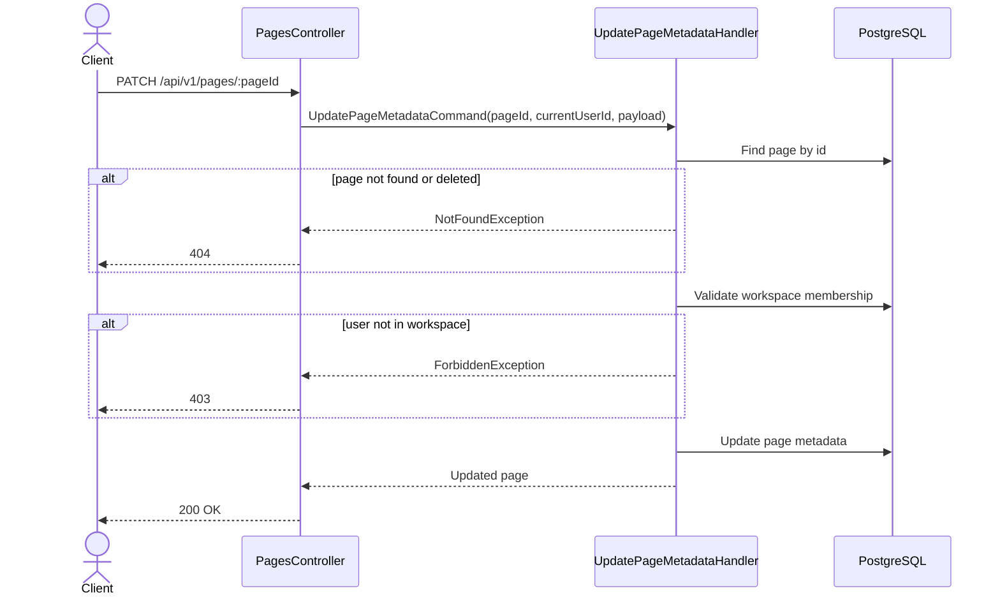

# 04 — Update Page Metadata API Spec

> **API:** `PATCH /api/v1/pages/:pageId`
> **Auth:** Required
> **Module:** Notes
> **Mục tiêu:** Cập nhật metadata của page như `title`, `icon`, `coverUrl`.

---

## Tổng Quan

API này dùng khi user chỉnh sửa thông tin cơ bản của page trong editor.

Ví dụ:

- Đổi title page
- Đổi icon emoji
- Đổi cover image
- Xóa icon
- Xóa cover

API này **không dùng để**:

- Move page
- Reorder page
- Update block content
- Archive/trash page

---

## 1. Endpoint

```http
PATCH /api/v1/pages/:pageId
```

Example:

```http
PATCH /api/v1/pages/page-uuid
```

---

## 2. Sequence Diagram



---

## 3. Request

### Path Parameters

| Field  | Type | Required | Description       |
| ------ | ---- | -------- | ----------------- |
| pageId | UUID | Yes      | Page cần cập nhật |

### Body

```json
{
  "title": "NestJS Notes",
  "icon": "🧠",
  "coverUrl": "https://example.com/cover.png"
}
```

### Request Fields

| Field    | Type        | Required | Description              |
| -------- | ----------- | -------- | ------------------------ |
| title    | string      | No       | Tiêu đề page             |
| icon     | string/null | No       | Icon hoặc emoji của page |
| coverUrl | string/null | No       | URL cover image          |

---

## 4. Response

### 200 OK

```json
{
  "message": "Page updated successfully",
  "data": {
    "id": "page-uuid",
    "workspaceId": "workspace-uuid",
    "parentId": null,
    "title": "NestJS Notes",
    "icon": "🧠",
    "coverUrl": "https://example.com/cover.png",
    "orderIndex": 0,
    "isArchived": false,
    "isDeleted": false,
    "createdAt": "2026-06-03T10:30:00.000Z",
    "updatedAt": "2026-06-03T11:00:00.000Z"
  },
  "timestamp": "2026-06-03T11:00:00.000Z",
  "path": "/api/v1/pages/page-uuid",
  "method": "PATCH"
}
```

---

## 5. Business Rules

1. Page phải tồn tại.
2. Page không được có `isDeleted = true`.
3. User phải là member của workspace chứa page.
4. Cho phép update partial field.
5. Nếu gửi `title`, title không được rỗng sau khi trim.
6. Nếu gửi `icon: null`, hệ thống hiểu là xóa icon.
7. Nếu gửi `coverUrl: null`, hệ thống hiểu là xóa cover.
8. Không cho update `workspaceId`, `parentId`, `orderIndex`, `isArchived`, `isDeleted` qua API này.
9. Sau khi update, cập nhật `updatedAt`.
10. Nếu có field `updatedById` hoặc `lastEditedBy`, set bằng current user id.

---

## 6. Query Logic

```sql
SELECT *
FROM pages
WHERE id = $1
  AND is_deleted = false
LIMIT 1;
```

Sau đó validate membership:

```sql
SELECT *
FROM user_workspaces
WHERE user_id = $1
  AND workspace_id = $2
LIMIT 1;
```

Update page:

```sql
UPDATE pages
SET
  title = COALESCE($1, title),
  icon = $2,
  cover_url = $3,
  updated_by_id = $4,
  updated_at = NOW()
WHERE id = $5
RETURNING *;
```

---

## 7. Repository Contract

```ts
findById(pageId: string): Promise<Page | null>;

updateMetadata(
  pageId: string,
  data: {
    title?: string;
    icon?: string | null;
    coverUrl?: string | null;
    updatedById: string;
  },
): Promise<Page>;
```

Recommended Prisma:

```ts
const page = await prisma.page.update({
  where: {
    id: pageId,
  },
  data: {
    ...(title !== undefined && { title }),
    ...(icon !== undefined && { icon }),
    ...(coverUrl !== undefined && { coverUrl }),
    updatedById: currentUserId,
  },
});
```

---

## 8. Error Cases

### 400 VALIDATION_ERROR

```json
{
  "message": "Validation failed"
}
```

Khi:

- `pageId` không đúng UUID format
- `title` rỗng
- `coverUrl` không đúng URL format

---

### 401 UNAUTHORIZED

```json
{
  "message": "Unauthorized"
}
```

Khi thiếu hoặc sai access token.

---

### 403 WORKSPACE_ACCESS_DENIED

```json
{
  "message": "You do not have access to this workspace."
}
```

Khi user không thuộc workspace của page.

---

### 404 PAGE_NOT_FOUND

```json
{
  "message": "Page not found."
}
```

Khi page không tồn tại hoặc đã bị soft delete.

---

## 9. Test Scenarios

| ID     | Scenario                  | Expected                                |
| ------ | ------------------------- | --------------------------------------- |
| T-PU01 | Update title hợp lệ       | 200                                     |
| T-PU02 | Update icon hợp lệ        | 200                                     |
| T-PU03 | Update coverUrl hợp lệ    | 200                                     |
| T-PU04 | Xóa icon bằng null        | 200 + icon=null                         |
| T-PU05 | Xóa cover bằng null       | 200 + coverUrl=null                     |
| T-PU06 | Title rỗng                | 400                                     |
| T-PU07 | PageId invalid UUID       | 400                                     |
| T-PU08 | Missing token             | 401                                     |
| T-PU09 | User không có quyền       | 403                                     |
| T-PU10 | Page không tồn tại        | 404                                     |
| T-PU11 | Page đã isDeleted=true    | 404                                     |
| T-PU12 | Update field không hợp lệ | Ignore hoặc 400 tùy validation strategy |

---

## 10. Technical Notes

- API này nên debounce khi user gõ title để tránh gọi quá nhiều request.
- Với title, frontend có thể autosave sau 500ms–1000ms.
- TanStack Query key đề xuất:

```ts
['page-detail', pageId];
```

Sau khi update thành công nên invalidate:

```ts
queryClient.invalidateQueries({
  queryKey: ['page-detail', pageId],
});

queryClient.invalidateQueries({
  queryKey: ['pages-tree', workspaceId],
});
```

---

## 11. Suggested File Name

```text
04_Update_Page_Metadata_API_Spec.md
```
