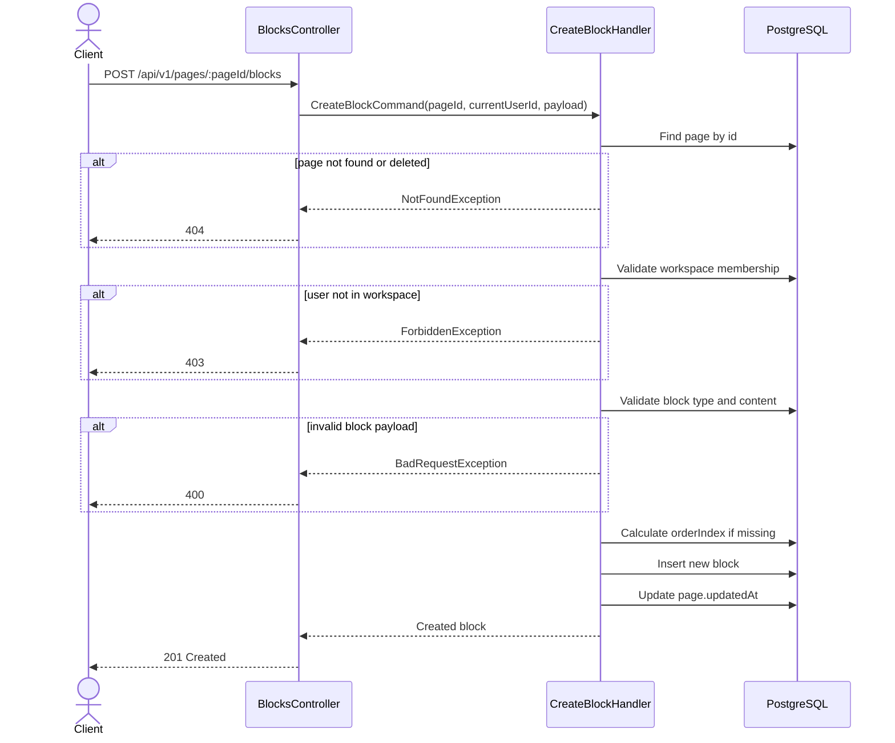

# 05 — Create Block API Spec

> **API:** `POST /api/v1/pages/:pageId/blocks`
> **Auth:** Required
> **Module:** Notes
> **Mục tiêu:** Tạo block mới trong một page để phục vụ editor kiểu Notion.

---

## Tổng Quan

API này được gọi khi user tạo một block mới trong editor.

Ví dụ:

- Nhấn Enter để tạo paragraph mới
- Thêm heading
- Thêm todo
- Thêm quote
- Thêm image block
- Thêm divider

API này chỉ tạo block trong một page đã tồn tại.

---

## 1. Endpoint

```http
POST /api/v1/pages/:pageId/blocks
```

Example:

```http
POST /api/v1/pages/page-uuid/blocks
```

---

## 2. Sequence Diagram



---

## 3. Request

### Path Parameters

| Field  | Type | Required | Description         |
| ------ | ---- | -------- | ------------------- |
| pageId | UUID | Yes      | Page chứa block mới |

### Body

```json
{
  "type": "paragraph",
  "content": {
    "text": "Hello Node Mind"
  },
  "orderIndex": 0
}
```

---

## 4. Request Fields

| Field      | Type   | Required | Description              |
| ---------- | ------ | -------- | ------------------------ |
| type       | string | Yes      | Loại block               |
| content    | object | Yes      | Nội dung block dạng JSON |
| orderIndex | number | No       | Vị trí block trong page  |

---

## 5. Supported Block Types

```text
paragraph
heading_1
heading_2
heading_3
bullet_list
numbered_list
todo
quote
code
image
divider
```

---

## 6. Response

### 201 Created

```json
{
  "message": "Block created successfully",
  "data": {
    "id": "block-uuid",
    "pageId": "page-uuid",
    "type": "paragraph",
    "content": {
      "text": "Hello Node Mind"
    },
    "orderIndex": 0,
    "createdAt": "2026-06-03T10:30:00.000Z",
    "updatedAt": "2026-06-03T10:30:00.000Z"
  },
  "timestamp": "2026-06-03T10:30:00.000Z",
  "path": "/api/v1/pages/page-uuid/blocks",
  "method": "POST"
}
```

---

## 7. Business Rules

1. Page phải tồn tại.
2. Page không được có `isDeleted = true`.
3. User phải là member của workspace chứa page.
4. `type` phải thuộc danh sách supported block types.
5. `content` phải là object JSON.
6. Nếu không gửi `orderIndex`, block sẽ được tạo ở cuối page.
7. Nếu gửi `orderIndex`, hệ thống nên normalize lại thứ tự block trong page.
8. Sau khi tạo block, cập nhật `updatedAt` của page cha.
9. API này không dùng để reorder toàn bộ blocks.
10. API này không tạo page mới.

---

## 8. Query Logic

Tìm page:

```sql
SELECT *
FROM pages
WHERE id = $1
  AND is_deleted = false
LIMIT 1;
```

Tính `orderIndex` nếu client không gửi:

```sql
SELECT COALESCE(MAX(order_index), -1) + 1 AS next_order_index
FROM blocks
WHERE page_id = $1;
```

Tạo block:

```sql
INSERT INTO blocks (
  id,
  page_id,
  type,
  content,
  order_index,
  created_at,
  updated_at
)
VALUES (
  $1,
  $2,
  $3,
  $4,
  $5,
  NOW(),
  NOW()
)
RETURNING *;
```

Update page cha:

```sql
UPDATE pages
SET updated_at = NOW()
WHERE id = $1;
```

---

## 9. Repository Contract

```ts
findPageById(pageId: string): Promise<Page | null>;

createBlock(data: {
  pageId: string;
  type: BlockType;
  content: Record<string, unknown>;
  orderIndex: number;
}): Promise<Block>;

getNextOrderIndex(pageId: string): Promise<number>;

touchPage(pageId: string): Promise<void>;
```

Recommended Prisma:

```ts
const block = await prisma.block.create({
  data: {
    pageId,
    type,
    content,
    orderIndex,
  },
});
```

Nếu cần transaction:

```ts
const result = await prisma.$transaction(async (tx) => {
  const block = await tx.block.create({
    data: {
      pageId,
      type,
      content,
      orderIndex,
    },
  });

  await tx.page.update({
    where: { id: pageId },
    data: { updatedAt: new Date() },
  });

  return block;
});
```

---

## 10. Error Cases

### 400 VALIDATION_ERROR

```json
{
  "message": "Validation failed"
}
```

Khi:

- `pageId` không đúng UUID format
- `type` không hợp lệ
- `content` không phải object JSON
- `orderIndex` nhỏ hơn 0

---

### 401 UNAUTHORIZED

```json
{
  "message": "Unauthorized"
}
```

Khi thiếu hoặc sai access token.

---

### 403 WORKSPACE_ACCESS_DENIED

```json
{
  "message": "You do not have access to this workspace."
}
```

Khi user không thuộc workspace của page.

---

### 404 PAGE_NOT_FOUND

```json
{
  "message": "Page not found."
}
```

Khi page không tồn tại hoặc đã bị soft delete.

---

## 11. Test Scenarios

| ID     | Scenario                      | Expected         |
| ------ | ----------------------------- | ---------------- |
| T-BC01 | Create paragraph block hợp lệ | 201              |
| T-BC02 | Create heading block hợp lệ   | 201              |
| T-BC03 | Không gửi orderIndex          | 201 + tạo ở cuối |
| T-BC04 | PageId invalid UUID           | 400              |
| T-BC05 | Type không hợp lệ             | 400              |
| T-BC06 | Content không phải object     | 400              |
| T-BC07 | Missing token                 | 401              |
| T-BC08 | User không thuộc workspace    | 403              |
| T-BC09 | Page không tồn tại            | 404              |
| T-BC10 | Page đã isDeleted=true        | 404              |

---

## 12. Technical Notes

- Frontend thường gọi API này khi user nhấn Enter hoặc chọn block type từ slash menu.
- Nếu editor có local-first state, có thể tạo temporary block id trước, sau đó replace bằng id từ server.
- Sau khi tạo block thành công, nên update cache của page detail.

TanStack Query key đề xuất:

```ts
['page-detail', pageId];
```

Sau khi tạo block thành công:

```ts
queryClient.invalidateQueries({
  queryKey: ['page-detail', pageId],
});
```

---

## 13. Suggested File Name

```text
05_Create_Block_API_Spec.md
```
