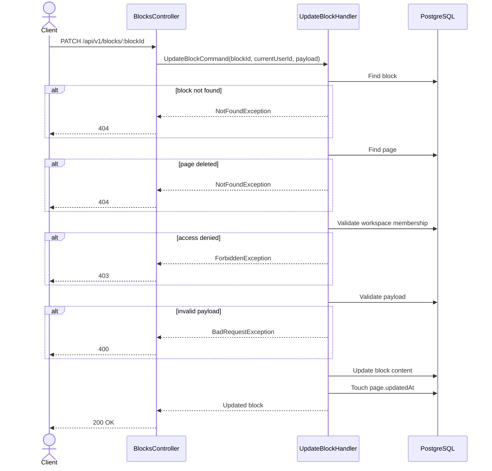

# 06 — Update Block API Spec

> **API:** `PATCH /api/v1/blocks/:blockId`
> **Auth:** Required
> **Module:** Notes
> **Mục tiêu:** Cập nhật nội dung block trong page.

---

## Tổng Quan

API này được gọi khi user chỉnh sửa nội dung block trong editor.

Ví dụ:

- Gõ thêm text
- Sửa heading
- Tick / untick todo
- Đổi quote
- Đổi code block
- Update image metadata

Frontend nên debounce request để tránh gọi API liên tục khi user đang gõ.

---

## 1. Endpoint

```http
PATCH /api/v1/blocks/:blockId
```

Example:

```http
PATCH /api/v1/blocks/block-uuid
```

---

## 2. Sequence Diagram



---

## 3. Request

### Path Parameters

| Field   | Type | Required | Description        |
| ------- | ---- | -------- | ------------------ |
| blockId | UUID | Yes      | Block cần cập nhật |

### Body

```json
{
  "content": {
    "text": "Hello Node Mind Updated"
  }
}
```

Hoặc với BlockNote:

```json
{
  "content": {
    "props": {
      "level": 1
    },
    "content": [
      {
        "type": "text",
        "text": "Hello Node Mind",
        "styles": {
          "bold": true
        }
      }
    ],
    "children": []
  }
}
```

---

## 4. Request Fields

| Field   | Type   | Required | Description        |
| ------- | ------ | -------- | ------------------ |
| content | object | Yes      | Nội dung block mới |

---

## 5. Response

### 200 OK

```json
{
  "message": "Block updated successfully",
  "data": {
    "id": "block-uuid",
    "pageId": "page-uuid",
    "type": "paragraph",
    "content": {
      "text": "Hello Node Mind Updated"
    },
    "orderIndex": 0,
    "updatedAt": "2026-06-03T10:30:00.000Z"
  }
}
```

---

## 6. Business Rules

1. Block phải tồn tại.
2. Block không thuộc page đã bị delete.
3. User phải thuộc workspace chứa page.
4. content phải là JSON object hợp lệ.
5. Không được thay đổi pageId.
6. Không được thay đổi orderIndex qua API này.
7. Sau khi update block phải cập nhật page.updatedAt.
8. Frontend nên debounce 500ms–2000ms.

---

## 7. Query Logic

Tìm block:

```sql
SELECT *
FROM blocks
WHERE id = $1
LIMIT 1;
```

Update block:

```sql
UPDATE blocks
SET
    content = $2,
    updated_at = NOW()
WHERE id = $1
RETURNING *;
```

Touch page:

```sql
UPDATE pages
SET updated_at = NOW()
WHERE id = $1;
```

---

## 8. Repository Contract

```ts
findById(blockId: string): Promise<Block | null>;

updateContent(
  blockId: string,
  content: Record<string, unknown>,
): Promise<Block>;

touchPage(pageId: string): Promise<void>;
```

Recommended Prisma:

```ts
await prisma.block.update({
  where: {
    id: blockId,
  },
  data: {
    content,
  },
});
```

Transaction:

```ts
await prisma.$transaction(async (tx) => {
  const block = await tx.block.update({
    where: {
      id: blockId,
    },
    data: {
      content,
    },
  });

  await tx.page.update({
    where: {
      id: block.pageId,
    },
    data: {
      updatedAt: new Date(),
    },
  });

  return block;
});
```

---

## 9. Error Cases

### 400 VALIDATION_ERROR

```json
{
  "message": "Validation failed"
}
```

### 401 UNAUTHORIZED

```json
{
  "message": "Unauthorized"
}
```

### 403 WORKSPACE_ACCESS_DENIED

```json
{
  "message": "You do not have access to this workspace."
}
```

### 404 BLOCK_NOT_FOUND

```json
{
  "message": "Block not found."
}
```

---

## 10. Test Scenarios

| ID     | Scenario         | Expected |
| ------ | ---------------- | -------- |
| T-BU01 | Update paragraph | 200      |
| T-BU02 | Update heading   | 200      |
| T-BU03 | Update todo      | 200      |
| T-BU04 | Invalid blockId  | 400      |
| T-BU05 | Invalid content  | 400      |
| T-BU06 | Missing token    | 401      |
| T-BU07 | Workspace denied | 403      |
| T-BU08 | Block not found  | 404      |

---

## 11. Technical Notes

TanStack Query:

```ts
['page-detail', pageId];
```

Sau khi update:

```ts
queryClient.invalidateQueries({
  queryKey: ['page-detail', pageId],
});
```

Khuyến nghị debounce:

```ts
const save = debounce(async () => {
  await updateBlock(blockId, payload);
}, 1000);
```

---

## 12. Suggested File Name

```text
06_Update_Block_API_Spec.md
```
