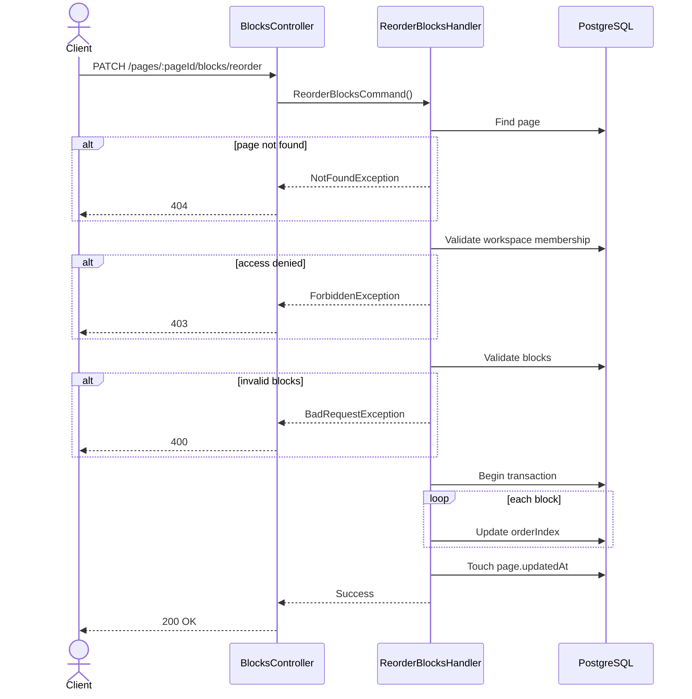

# 07 — Reorder Blocks API Spec

> **API:** `PATCH /api/v1/pages/:pageId/blocks/reorder`
> **Auth:** Required
> **Module:** Notes
> **Mục tiêu:** Cập nhật thứ tự hiển thị của các block trong page.

---

## Tổng Quan

API này được gọi khi user kéo thả block trong editor để thay đổi vị trí.

Ví dụ:

- Kéo paragraph lên trên heading
- Kéo todo xuống cuối page
- Reorder nhiều block cùng lúc

API không dùng để tạo block mới.

API không dùng để cập nhật nội dung block.

---

## 1. Endpoint

```http
PATCH /api/v1/pages/:pageId/blocks/reorder
```

Example:

```http
PATCH /api/v1/pages/page-uuid/blocks/reorder
```

---

## 2. Sequence Diagram



---

## 3. Request

### Path Parameters

| Field  | Type | Required | Description             |
| ------ | ---- | -------- | ----------------------- |
| pageId | UUID | Yes      | Page cần reorder blocks |

### Body

```json
{
  "blocks": [
    {
      "id": "block-a",
      "orderIndex": 0
    },
    {
      "id": "block-d",
      "orderIndex": 1
    },
    {
      "id": "block-b",
      "orderIndex": 2
    },
    {
      "id": "block-c",
      "orderIndex": 3
    }
  ]
}
```

---

## 4. Request Fields

| Field               | Type   | Required | Description                  |
| ------------------- | ------ | -------- | ---------------------------- |
| blocks              | array  | Yes      | Danh sách block cần cập nhật |
| blocks[].id         | UUID   | Yes      | ID block                     |
| blocks[].orderIndex | number | Yes      | Vị trí mới                   |

---

## 5. Response

### 200 OK

```json
{
  "message": "Blocks reordered successfully",
  "data": {
    "pageId": "page-uuid"
  }
}
```

---

## 6. Business Rules

1. Page phải tồn tại.
2. User phải thuộc workspace chứa page.
3. Tất cả block phải thuộc page hiện tại.
4. Không được reorder block của page khác.
5. orderIndex phải >= 0.
6. Không được duplicate blockId.
7. Thực hiện update trong transaction.
8. Sau khi reorder phải cập nhật page.updatedAt.

---

## 7. Query Logic

Lấy danh sách block:

```sql
SELECT *
FROM blocks
WHERE page_id = $1;
```

Update order:

```sql
UPDATE blocks
SET
    order_index = $2,
    updated_at = NOW()
WHERE id = $1;
```

Touch page:

```sql
UPDATE pages
SET updated_at = NOW()
WHERE id = $1;
```

---

## 8. Repository Contract

```ts
findPageById(pageId: string): Promise<Page | null>;

findBlocksByPageId(pageId: string): Promise<Block[]>;

reorderBlocks(
  pageId: string,
  items: {
    id: string;
    orderIndex: number;
  }[],
): Promise<void>;

touchPage(pageId: string): Promise<void>;
```

Recommended Prisma:

```ts
await prisma.$transaction(async (tx) => {
  for (const block of blocks) {
    await tx.block.update({
      where: {
        id: block.id,
      },
      data: {
        orderIndex: block.orderIndex,
      },
    });
  }

  await tx.page.update({
    where: {
      id: pageId,
    },
    data: {
      updatedAt: new Date(),
    },
  });
});
```

---

## 9. Error Cases

### 400 VALIDATION_ERROR

```json
{
  "message": "Validation failed"
}
```

### 401 UNAUTHORIZED

```json
{
  "message": "Unauthorized"
}
```

### 403 WORKSPACE_ACCESS_DENIED

```json
{
  "message": "You do not have access to this workspace."
}
```

### 404 PAGE_NOT_FOUND

```json
{
  "message": "Page not found."
}
```

---

## 10. Test Scenarios

| ID     | Scenario                | Expected |
| ------ | ----------------------- | -------- |
| T-BR01 | Reorder 2 blocks        | 200      |
| T-BR02 | Reorder multiple blocks | 200      |
| T-BR03 | Invalid pageId          | 400      |
| T-BR04 | Missing token           | 401      |
| T-BR05 | Workspace denied        | 403      |
| T-BR06 | Page not found          | 404      |
| T-BR07 | Duplicate block id      | 400      |
| T-BR08 | Block from another page | 400      |

---

## 11. Technical Notes

BlockNote drag & drop:

```ts
editor.document.map((block, index) => ({
  id: block.id,
  orderIndex: index,
}));
```

Frontend nên chỉ gọi API khi drag hoàn tất.

Không gọi API trong lúc user đang kéo.

---

## 12. Suggested File Name

```text
07_Reorder_Blocks_API_Spec.md
```
