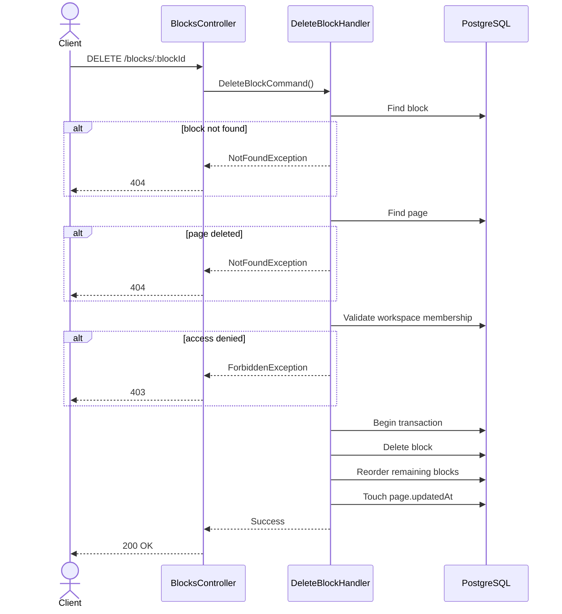

# 08 — Delete Block API Spec

> **API:** `DELETE /api/v1/blocks/:blockId`
> **Auth:** Required
> **Module:** Notes
> **Mục tiêu:** Xóa block khỏi page.

---

## Tổng Quan

API này được gọi khi user xóa một block trong editor.

Ví dụ:

- Xóa paragraph
- Xóa heading
- Xóa todo
- Xóa image block
- Xóa code block

Sau khi xóa:

- Block sẽ bị remove khỏi database.
- Các block phía sau sẽ được cập nhật lại `orderIndex`.
- `page.updatedAt` được cập nhật.

---

## 1. Endpoint

```http
DELETE /api/v1/blocks/:blockId
```

Example:

```http
DELETE /api/v1/blocks/block-uuid
```

---

## 2. Sequence Diagram



---

## 3. Request

### Path Parameters

| Field   | Type | Required | Description   |
| ------- | ---- | -------- | ------------- |
| blockId | UUID | Yes      | Block cần xóa |

### Body

```json
{}
```

---

## 4. Request Fields

Không có request body.

---

## 5. Response

### 200 OK

```json
{
  "message": "Block deleted successfully",
  "data": {
    "id": "block-uuid"
  }
}
```

---

## 6. Business Rules

1. Block phải tồn tại.
2. User phải thuộc workspace chứa page.
3. Không được xóa block thuộc page khác.
4. Sau khi xóa phải cập nhật lại `orderIndex`.
5. Sau khi xóa phải cập nhật `page.updatedAt`.
6. Thực hiện trong transaction.
7. Nếu block cuối cùng bị xóa thì page vẫn hợp lệ.

---

## 7. Query Logic

Tìm block:

```sql
SELECT *
FROM blocks
WHERE id = $1
LIMIT 1;
```

Xóa block:

```sql
DELETE FROM blocks
WHERE id = $1;
```

Cập nhật thứ tự các block phía sau:

```sql
UPDATE blocks
SET order_index = order_index - 1
WHERE page_id = $1
AND order_index > $2;
```

Touch page:

```sql
UPDATE pages
SET updated_at = NOW()
WHERE id = $1;
```

---

## 8. Repository Contract

```ts
findById(blockId: string): Promise<Block | null>;

delete(blockId: string): Promise<void>;

reorderAfterDelete(
  pageId: string,
  deletedOrderIndex: number,
): Promise<void>;

touchPage(pageId: string): Promise<void>;
```

Recommended Prisma:

```ts
await prisma.$transaction(async (tx) => {
  const block = await tx.block.findUniqueOrThrow({
    where: {
      id: blockId,
    },
  });

  await tx.block.delete({
    where: {
      id: blockId,
    },
  });

  await tx.block.updateMany({
    where: {
      pageId: block.pageId,
      orderIndex: {
        gt: block.orderIndex,
      },
    },
    data: {
      orderIndex: {
        decrement: 1,
      },
    },
  });

  await tx.page.update({
    where: {
      id: block.pageId,
    },
    data: {
      updatedAt: new Date(),
    },
  });
});
```

---

## 9. Error Cases

### 400 VALIDATION_ERROR

```json
{
  "message": "Validation failed"
}
```

### 401 UNAUTHORIZED

```json
{
  "message": "Unauthorized"
}
```

### 403 WORKSPACE_ACCESS_DENIED

```json
{
  "message": "You do not have access to this workspace."
}
```

### 404 BLOCK_NOT_FOUND

```json
{
  "message": "Block not found."
}
```

---

## 10. Test Scenarios

| ID     | Scenario                  | Expected |
| ------ | ------------------------- | -------- |
| T-BD01 | Delete paragraph          | 200      |
| T-BD02 | Delete heading            | 200      |
| T-BD03 | Delete todo               | 200      |
| T-BD04 | Invalid blockId           | 400      |
| T-BD05 | Missing token             | 401      |
| T-BD06 | Workspace denied          | 403      |
| T-BD07 | Block not found           | 404      |
| T-BD08 | Delete last block in page | 200      |

---

## 11. Technical Notes

TanStack Query:

```ts
queryClient.invalidateQueries({
  queryKey: ['page-detail', pageId],
});
```

BlockNote:

```ts
editor.removeBlocks([block]);
```

Sau khi xóa thành công:

```ts
await deleteBlock(blockId);
```

refresh page detail hoặc update cache local.

---

## 12. Suggested File Name

```text
08_Delete_Block_API_Spec.md
```
