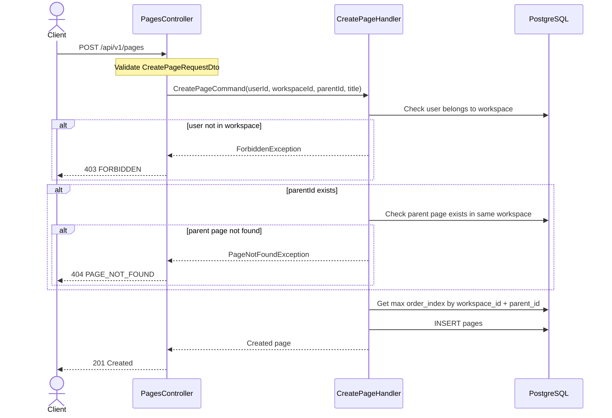

# 01 — Create Page API Spec

> **API:** `POST /api/v1/pages`
> **Auth:** Required
> **Module:** Notes
> **Mục tiêu:** Tạo một page mới trong workspace. Page có thể là root page hoặc child page của một page khác.

---

## Tổng Quan

API Create Page dùng để tạo note/page mới trong hệ thống Node Mind.

Page thuộc về một `workspace`. Nếu `parentId = null`, page sẽ là root page và hiển thị ở cấp đầu tiên trong sidebar. Nếu có `parentId`, page sẽ là page con của một page khác.

Page mới mặc định có title là `"Untitled"` nếu client không truyền `title`.

---

## 1. Sequence Diagram



---

## 2. Request

```json
{
  "workspaceId": "018fd1e8-3c74-7f41-9fb2-78a7790d1b2a",
  "parentId": null,
  "title": "Backend Notes",
  "icon": "🧠"
}
```

| Field         | Type        | Required | Rule                                |
| ------------- | ----------- | -------- | ----------------------------------- |
| `workspaceId` | string      | Yes      | UUID                                |
| `parentId`    | string/null | No       | UUID hoặc `null`                    |
| `title`       | string      | No       | Nếu không truyền, dùng `"Untitled"` |
| `icon`        | string/null | No       | Emoji hoặc icon text                |

---

## 3. Response

### 201 Created

```json
{
  "message": "Page created successfully",
  "data": {
    "id": "0190a1f5-7b1a-7000-9e8f-98d82b123456",
    "workspaceId": "018fd1e8-3c74-7f41-9fb2-78a7790d1b2a",
    "parentId": null,
    "title": "Backend Notes",
    "icon": "🧠",
    "coverUrl": null,
    "orderIndex": 0,
    "isFavorite": false,
    "isArchived": false,
    "isDeleted": false,
    "createdById": "018fd1e8-3c74-7f41-9fb2-user123",
    "updatedById": null,
    "createdAt": "2026-06-03T10:30:00.000Z",
    "updatedAt": "2026-06-03T10:30:00.000Z"
  },
  "timestamp": "2026-06-03T10:30:00.000Z",
  "path": "/api/v1/pages",
  "method": "POST"
}
```

---

## 4. Create Page Handler Steps

1. Nhận input từ `CreatePageRequestDto`.
2. Lấy `userId` từ JWT payload.
3. Kiểm tra user có thuộc `workspaceId` không.
4. Nếu có `parentId`, kiểm tra parent page tồn tại trong cùng workspace.
5. Tính `orderIndex` mới:
   - Nếu root page: lấy max `order_index` theo `workspace_id` và `parent_id IS NULL`.
   - Nếu child page: lấy max `order_index` theo `workspace_id` và `parent_id`.

6. Tạo page mới.
7. Trả response page vừa tạo.

---

## 5. Database

Bảng chính: `pages`

```prisma
model Page {
  id          String  @id @default(uuid()) @db.Uuid
  workspaceId String @map("workspace_id") @db.Uuid
  parentId    String? @map("parent_id") @db.Uuid

  title       String @default("Untitled") @db.VarChar(500)
  icon        String? @db.VarChar(50)
  coverUrl    String? @map("cover_url")

  orderIndex  Int @default(0) @map("order_index")

  isFavorite  Boolean @default(false) @map("is_favorite")
  isArchived  Boolean @default(false) @map("is_archived")
  isDeleted   Boolean @default(false) @map("is_deleted")
  deletedAt   DateTime? @map("deleted_at") @db.Timestamptz(6)

  createdById String @map("created_by_id") @db.Uuid
  updatedById String? @map("updated_by_id") @db.Uuid

  createdAt   DateTime @default(now()) @map("created_at") @db.Timestamptz(6)
  updatedAt   DateTime @default(now()) @updatedAt @map("updated_at") @db.Timestamptz(6)

  parent       Page? @relation("PageTree", fields: [parentId], references: [id], onDelete: Cascade)
  children     Page[] @relation("PageTree")

  @@index([workspaceId])
  @@index([parentId])
  @@index([workspaceId, parentId])
  @@map("pages")
}
```

---

## 6. Error Cases

### 400 VALIDATION_ERROR

```json
{
  "message": "Validation failed",
  "error": {
    "code": "VALIDATION_ERROR",
    "details": ["workspaceId must be a UUID", "title must be a string"]
  },
  "timestamp": "2026-06-03T10:30:00.000Z",
  "path": "/api/v1/pages",
  "method": "POST"
}
```

### 401 UNAUTHORIZED

Xảy ra khi request không có access token hoặc token không hợp lệ.

```json
{
  "message": "Unauthorized",
  "error": {
    "code": "UNAUTHORIZED",
    "details": null
  },
  "timestamp": "2026-06-03T10:30:00.000Z",
  "path": "/api/v1/pages",
  "method": "POST"
}
```

### 403 FORBIDDEN

User không thuộc workspace.

```json
{
  "message": "You do not have access to this workspace.",
  "error": {
    "code": "WORKSPACE_ACCESS_DENIED",
    "details": null
  },
  "timestamp": "2026-06-03T10:30:00.000Z",
  "path": "/api/v1/pages",
  "method": "POST"
}
```

### 404 PAGE_NOT_FOUND

Parent page không tồn tại hoặc không thuộc workspace hiện tại.

```json
{
  "message": "Parent page not found.",
  "error": {
    "code": "PAGE_NOT_FOUND",
    "details": null
  },
  "timestamp": "2026-06-03T10:30:00.000Z",
  "path": "/api/v1/pages",
  "method": "POST"
}
```

---

## 7. Test Scenarios

| ID    | Scenario                      | Expected                      |
| ----- | ----------------------------- | ----------------------------- |
| T-P01 | Tạo root page hợp lệ          | 201 + `parentId = null`       |
| T-P02 | Tạo child page hợp lệ         | 201 + `parentId` đúng         |
| T-P03 | Không truyền title            | 201 + title = `"Untitled"`    |
| T-P04 | Workspace không tồn tại       | 403 hoặc 404 tùy policy       |
| T-P05 | User không thuộc workspace    | 403 `WORKSPACE_ACCESS_DENIED` |
| T-P06 | Parent page không tồn tại     | 404 `PAGE_NOT_FOUND`          |
| T-P07 | Parent page khác workspace    | 404 `PAGE_NOT_FOUND`          |
| T-P08 | Token thiếu hoặc sai          | 401 `UNAUTHORIZED`            |
| T-P09 | `workspaceId` sai format UUID | 400 `VALIDATION_ERROR`        |
| T-P10 | Tạo nhiều page cùng parent    | `orderIndex` tăng đúng thứ tự |

---

## 8. Notes

- Phase 1 chưa cần realtime.
- Phase 1 chưa sync Neo4j.
- Phase 1 chưa tạo block mặc định.
- Page mới có thể không có block nào.
- Client sau khi tạo page nên redirect sang `/pages/{pageId}`.
